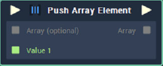
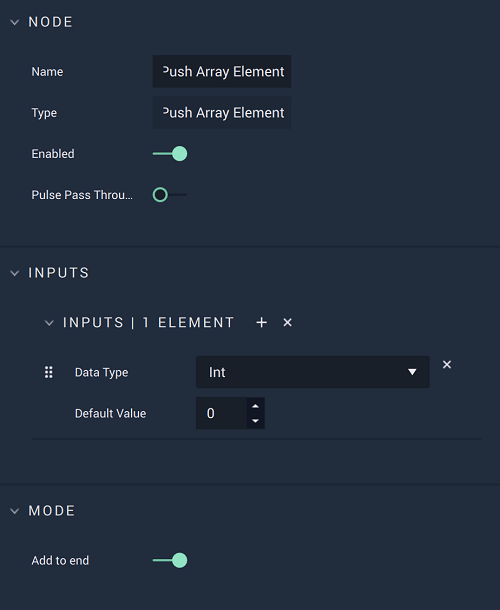

# Push Array Element

## Overview

**Push Array Element** adds element/s to an **Array**. The **Array** is given as input to the **Node**.

If no **Array** is given as input, the elements are added to a new, empty **Array**.

[**Scope**](../overview.md#scopes): **Project**, **Scene**, **Function**, **Prefab**.

## Attributes

### Inputs

`Inputs` - The number of **Input** elements you wish to add to the **Input** **Array**. Each element has the following **Attributes**:

| Attribute | Type | Description |
| :--- | :--- | :--- |
| `Data Type` | **Drop-down** | The `Data Type` of the element you wish to add the **Input** **Array**. |
| `Default Value` | _Defined in the_ `Data Type` _**Attribute**_. | A `Default Value` you wish to add to the **Array** if no value is provided to the **Input** **Socket**. |

### Mode

The `Mode` is a toggle that determines whether element/s will be added to the front or back of the **Array**.

| Attribute | Type | Description |
| :--- | :--- | :--- |
| `Add to end` | **Bool** | If the toggle is switched on, the desired element is added to the back of the **Array** otherwise it will be added to the front of the **Array**. |

## Inputs

| Input | Type | Description |
| :--- | :--- | :--- |
| _Pulse Input_ \(►\) | **Pulse** | A standard **Input Pulse**, to trigger the execution of the **Node**. |
| `Array (optional)` | **Array** | An **Array** to which you wish to add element/s. |
| `Value [n]` | _Defined in the_ `Data Type` _**Attribute**_ | The value you wish to add to a desired **Array**. |

## Outputs

| Output | Type | Description |
| :--- | :--- | :--- |
| _Pulse Output_ \(►\) | **Pulse** | A standard **Output Pulse**, to move onto the next **Node** along the **Logic Branch**, once this **Node** has finished its execution. |
| `Array` | **Array** | The resulting **Array** after the desired values are successfully added. |

## See Also

* [**Array Value**](array-value.md)
* [**Pop Array Element**](pop-array-element.md)

