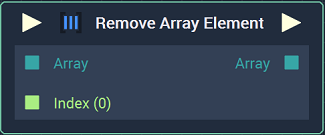
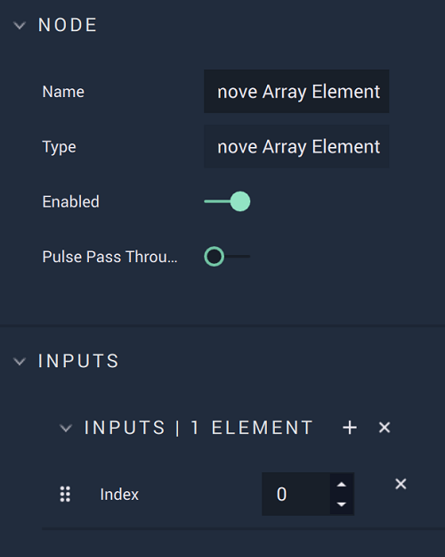

# Overview

The **Remove Array Element Node** deletes the element(s) of an **Array** at the specified index/indices. 

For example, an **Array** is populated as follows: $$[0,3,6,9,12]$$. If the *indices* $$1$$ and $$3$$ are given, the elements at those indices are deleted and the user is left with a new **Array**: $$[0,6,12]$$. 

[**Scope**](../overview.md#scopes): **Project**, **Scene**, **Function**, **Prefab**.

# Attributes

|Attribute|Type|Description|
|---|---|---|
|`Index [n]`|**Drop-down**|The index, or indices, of the element(s) to be removed, if one is not provided in the **Input Socket**.|

# Inputs

|Input|Type|Description|
|---|---|---|
|*Pulse Input* (►)|**Pulse**|A standard **Input Pulse**, to trigger the execution of the **Node**.|
|`Array`|**Array**|The **Array** whose element(s) will be removed.|
|`Index (i)[n]`|**Int**|The index `i` where the element will be removed. `n` determines the number of **Input Sockets** available.|

# Outputs

|Output|Type|Description|
|---|---|---|
|*Pulse Output* (►)|**Pulse**|A standard **Output Pulse**, to move onto the next **Node** along the **Logic Branch**, once this **Node** has finished its execution.|
|`Array`|**Array**|The **Array** without the element(s) that were specified to be removed.|

# See Also

* [**Insert Array Element**](insert-array-element.md)