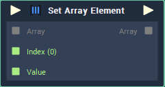
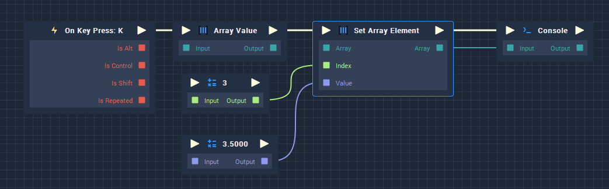

# Set Array Element

## Overview

**Set Array Element** updates element/s in an **Array** to new values. For this, it receives the `Index` of the element to update and the `Value` to which it will be updated.

If the `Index` is out of range for the **Array**, it will extend the **Array** up to the `Index` and fill the newly created element/s with empty element/s of the data type **Any**.

## Attributes

### Inputs

`Inputs` - The number of elements you wish to set the value of. Each **Input** element has the following **Attributes**:

| Attribute | Type | Description |
| :--- | :--- | :--- |
| `Index` | **Int** | The default `Index` of the element you wish to update if no value is provided in the `Index` **Input** **Socket**. |
| `Data Type` | **Drop-down** | The `Data Type` of the `Index` element you wish to update. |
| `Default Value` | _Defined in the_ `Data Type` _**Attribute**_. | The element whose `Index` is specified in the `Index` **Attribute** will be updated with this value. |

## Inputs

| Input | Type | Description |
| :--- | :--- | :--- |
| _Pulse Input_ \(►\) | **Pulse** | A standard **Input Pulse**, to trigger the execution of the **Node**. |
| `Array` | **Array** | An **Array** whose element/s you wish to update. |
| `Index` | **Int** | The `Index` of the element you wish to update. |
| `Value` | _Defined in the_ `Data Type` _**Attribute**_. | An **Input** value that is used to replace the element whose _index_ is specified in the `Index` **Input** **Socket**. |

## Outputs

| Output | Type | Description |
| :--- | :--- | :--- |
| _Pulse Output_ \(►\) | **Pulse** | A standard **Output Pulse**, to move onto the next **Node** along the **Logic Branch**, once this **Node** has finished its execution. |
| `Array` | **Array** | An **Output** **Array** whose element/s have been replaced with the desired values. |

## Example Usage

## See Also

* [**Array Value**](array-value.md)
* [**Pop Array Element**](pop-array-element.md)

