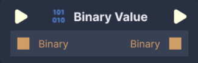
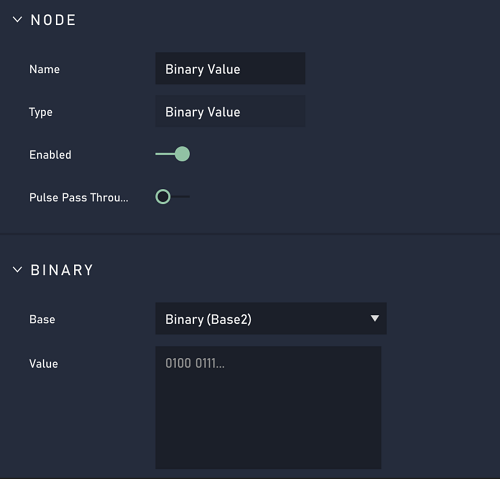

# Binary Value

## Overview

The **Binary Value** stores the inputted value as bytes.

[**Scope**](../overview.md#scopes): **Project**, **Scene**, **Function**, **Prefab**.

## Attributes

### Default

| Attribute | Type | Description |
| :--- | :--- | :--- |
|`Base`|**Dropdown**|The form the inputted value takes. This can either be `Binary (Base2)` or `Hex (Base16)`. When `Binary (Base2)` is selected, only 1 and 0 are allowed in the `Value` **Attribute**. When `Binary (Base16)` is selected, only numbers from 0-9 and letters A-F are allowed in the `Value` **Attribute**. 
| `Value` | **String** | The `Value` that the generated number will have. |

## Inputs

| Input | Type | Description |
| :--- | :--- | :--- |
| _Pulse Input_ \(►\) | **Pulse** | A standard **Input Pulse**, to trigger the execution of the **Node**. |
| `Input` | **Binary** | A binary number you wish to add to the **Binary Value** **Node**. |

## Outputs

| Output | Type | Description |
| :--- | :--- | :--- |
| _Pulse Output_ \(►\) | **Pulse** | A standard **Output Pulse**, to move onto the next **Node** along the **Logic Branch**, once this **Node** has finished its execution. |
| `Output` | **Binary** | The generated binary number represented as hexadecimal. |

## External Links

* [_Hexadecimal_](https://en.wikipedia.org/wiki/Hexadecimal) on Wikipedia.
* [_Binary and Hexadecimal Numbers_](https://www.electronics-tutorials.ws/binary/bin_3.html) on Electronics Tutorials.

