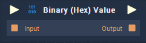

# Overview

The **Binary (Hex) Value** generates a binary number represented as hexadecimal.

# Attributes

## Default 

|Attribute|Type|Description|
|---|---|---|
| `Value` | **String** | The `Value` that the generated number will have. |

# Inputs

|Input|Type|Description|
|---|---|---|
|*Pulse Input* (►)|**Pulse**|A standard **Input Pulse**, to trigger the execution of the **Node**.|
| `Input` | **Binary** | A binary number you wish to add to the **Binary (Hex) Value** **Node**. |

# Outputs

|Output|Type|Description|
|---|---|---|
|*Pulse Output* (►)|**Pulse**|A standard **Output Pulse**, to move onto the next **Node** along the **Logic Branch**, once this **Node** has finished its execution.|
| `Output` | **Binary** | The generated binary number represented as hexadecimal. |

# External Links

* [_Hexadecimal_](https://en.wikipedia.org/wiki/Hexadecimal) on Wikipedia.
* [_Binary and Hexadecimal Numbers_](https://www.electronics-tutorials.ws/binary/bin_3.html) on Electronics Tutorials.
