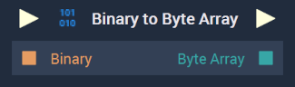

# Overview

The **Binary to Byte Array** takes a series of several bytes and puts them into an **Array** where each element is one byte. So, for example, if some **Binary Value** contains the series of five bytes `01000100 01011100 000001111 000001111 00000111`, this would be turned into the **Array** `[01000100, 01011100, 000001111, 000001111, 000001111]`.

[**Scope**](../overview.md#scopes): **Project**, **Scene**, **Function**, **Prefab**.

# Inputs

|Input|Type|Description|
|---|---|---|
|*Pulse Input* (►)|**Pulse**|A standard **Input Pulse**, to trigger the execution of the **Node**.|
|`Binary`|**Binary**|The inputted **Binary** message.|

# Outputs

|Output|Type|Description|
|---|---|---|
|*Pulse Output* (►)|**Pulse**|A standard **Output Pulse**, to move onto the next **Node** along the **Logic Branch**, once this **Node** has finished its execution.|
|`Byte Array`|**Array**|The resulting **Array** which consists of single bytes. The length of the **Array** is equivalent to the number of bytes in the inputted message.|

