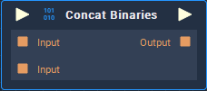

# Overview

**Concat Binaries** merges two or more **Binary** numbers into one new. The numbers to be merged are given as input in hexadecimal representation to the **Node**.

# Attributes

## Inputs

|Attribute|Type|Description|
|---|---|---|
| `Input [n]` | **Binary** | The default value of the **Binary** number, if none is given in the **Input Socket**. |

# Inputs

|Input|Type|Description|
|---|---|---|
|*Pulse Input* (►)|**Pulse**|A standard **Input Pulse**, to trigger the execution of the **Node**.|
| `Input [n]` | **Binary** | Two or more **Binary** numbers to merge. |

# Outputs

|Output|Type|Description|
|---|---|---|
|*Pulse Output* (►)|**Pulse**|A standard **Output Pulse**, to move onto the next **Node** along the **Logic Branch**, once this **Node** has finished its execution.|
| `Output` | **Binary** | The merged **Binary** number. |

