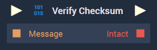
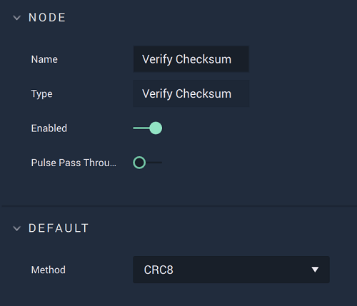

# Overview

The **Verify Checksum Node** checks if a **Binary** message is complete and verifies its checksum. 

[**Scope**](../overview.md#scopes): **Project**, **Scene**, **Function**, **Prefab**.

# Attributes

|Attribute|Type|Description|
|---|---|---|
|`Method`|**Dropdown**|The type of checksum to be used. This is currently just `CRC8`, a type of cyclic redundancy check.|

# Inputs

|Input|Type|Description|
|---|---|---|
|*Pulse Input* (►)|**Pulse**|A standard **Input Pulse**, to trigger the execution of the **Node**.|
|`Message`|**Binary**|The **Binary** message to be checked.|

# Outputs

|Output|Type|Description|
|---|---|---|
|*Pulse Output* (►)|**Pulse**|A standard **Output Pulse**, to move onto the next **Node** along the **Logic Branch**, once this **Node** has finished its execution.|
|`Intact`|**Bool**|A boolean which returns *true* if the **Binary** message passes the checks, and *false* if not.|

# External Links

* Read more on checksum [*here*.](https://en.wikipedia.org/wiki/Checksum)

