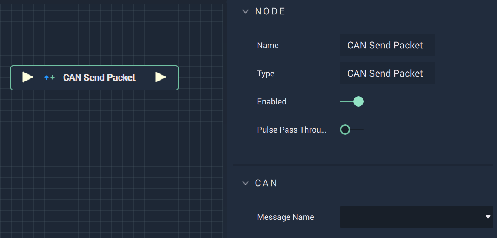

# Overview

The **CAN Send Packet Node** is used to send information, perhaps to update the status of a site after a **Signal** is received.

# Inputs

|Input|Type|Description|
|---|---|---|
|*Pulse Input* (►)|**Pulse**|A standard **Input Pulse**, to trigger the execution of the **Node**.|

# Outputs

|Output|Type|Description|
|---|---|---|
|*Pulse Output* (►)|**Pulse**|A standard **Output Pulse**, to move onto the next **Node** along the **Logic Branch**, once this **Node** has finished its execution.|

# See Also

* [**CAN Start**](canstart.md)
* [**CAN Stop**](canstop.md)
