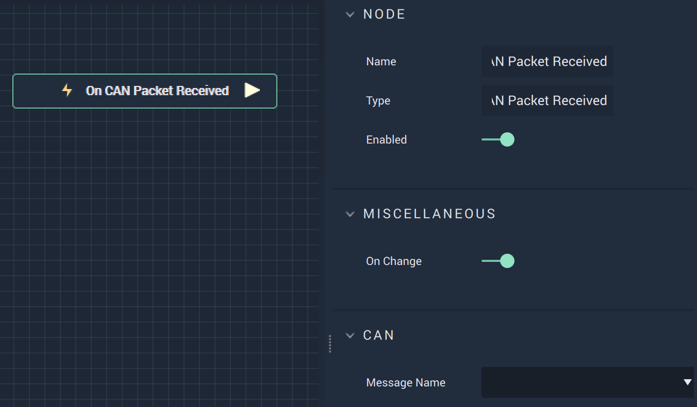

# Overview

**On CAN Packet Received** is an **Event Listener Node** that gives the user a way to perform an action once a **CAN** `Message` is selected from the **Dropdown Menu**.

# Attributes

|Attribute|Type|Description|
|---|---|---|
|`On Change`|**Bool**|Returns true or false depending on whether the user wants **On Change** functionality (fires whenever `Message Name` changes)
|`Message Name`|**Dropdown**|A `Message` that is chosen from the uploaded *DBC* file. This is done in **Project Settings**.|

# Outputs

|Output|Type|Description|
|---|---|---|
|*Pulse Output* (►)|**Pulse**|A standard **Output Pulse**, to move onto the next **Node** along the **Logic Branch**, once this **Node** has finished its execution.|

# See Also

* [**On CAN Start**](oncanstart.md)
* [**On CAN Stop**](oncanstop.md)