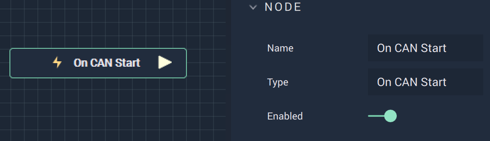

# Overview

**On CAN Start** is an **Event Listener Node** that gives the user a way to perform an action once a **CAN** process has begun.

# Outputs

|Output|Type|Description|
|---|---|---|
|*Pulse Output* (►)|**Pulse**|A standard **Output Pulse**, to move onto the next **Node** along the **Logic Branch**, once this **Node** has finished its execution.|

# See Also

* [**On CAN Packet Received**](oncanpacketreceived)]
* [**On CAN Stop**](oncanstop.md)
