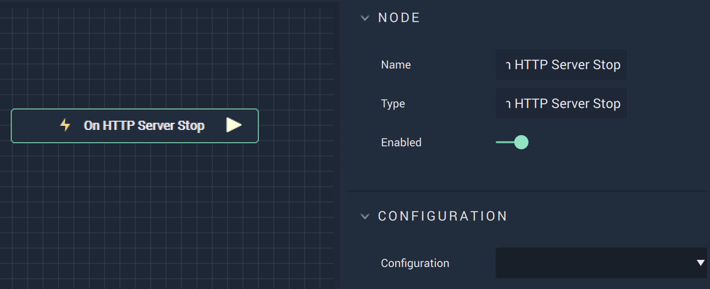

# Overview

**On HTTP Server Stop** is an **Event Listener Node** that gives the user a way to perform an action once a server stops.

# Attributes

|Attribute|Type|Description|
|---|---|---|
|`Configuration`|**Dropdown**|???|

# Outputs

|Output|Type|Description|
|---|---|---|
|*Pulse Output* (►)|**Pulse**|A standard **Output Pulse**, to move onto the next **Node** along the **Logic Branch**, once this **Node** has finished its execution.|

# See Also

* [**On HTTP Server Start**](onhttpserverstart.md)

