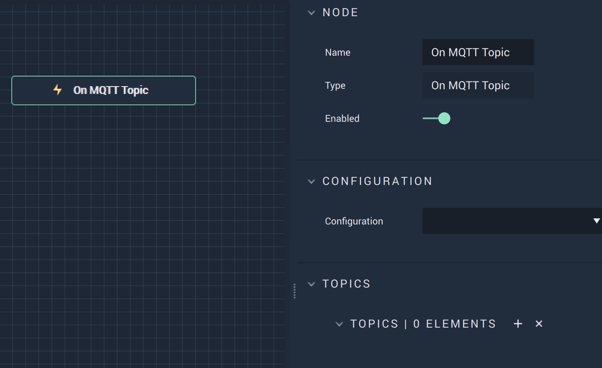

# Overview

**On MQTT Topic** is an **Event Listener Node** that fires when it receives a `Topic`. 

# Attributes

|Attribute|Type|Description|
|---|---|---|
|`Configuration`|**Dropdown**|The connection, or signal name, that will be used.|
|`Topic`|**User Input**|The key in the **MQTT** key/value pair.|

# See Also

* [**On MQTT Start**](onmqttstart.md)
* [**On MQTT Topic**](onmqtttopic.md)

