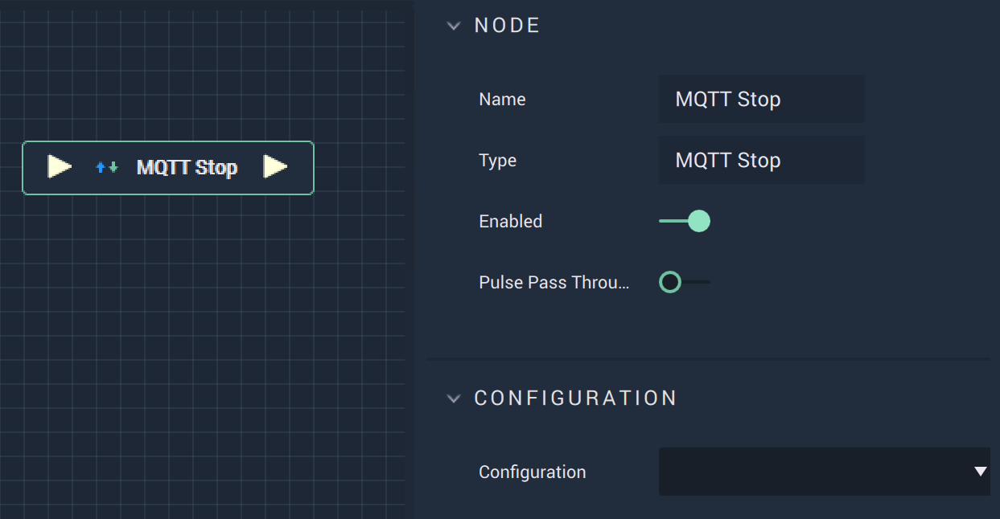

# Overview

The **MQTT Stop Node** stops the **MQTT** connection.

# Attributes

|Attribute|Type|Description|
|---|---|---|
|`Configuration`|**Dropdown**|The connection, or signal name, that will be used.|

# Inputs

|Input|Type|Description|
|---|---|---|
|*Pulse Input* (►)|**Pulse**|A standard **Input Pulse**, to trigger the execution of the **Node**.|

# Outputs

|Output|Type|Description|
|---|---|---|
|*Pulse Output* (►)|**Pulse**|A standard **Output Pulse**, to move onto the next **Node** along the **Logic Branch**, once this **Node** has finished its execution.|

# See Also

* [**MQTT Start**](mqttstart.md)
* [**MQTT Subscribe**](mqttsubscribe.md)
* [**MQTT Publish**](mqttpublish.md)

