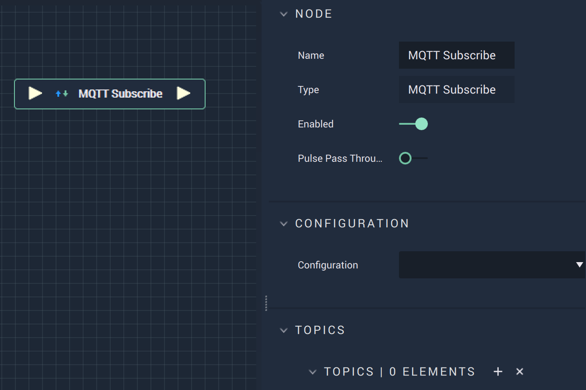

# Overview

The **MQTT Subscribe** listens for the `Topic`, or key of the **MQTT** key/value pair.

# Attributes

|Attribute|Type|Description|
|---|---|---|
|`Configuration`|**Dropdown**|The connection, or signal name, that will be used.|
|`Topic`|**User Input**|The key in the **MQTT** key/value pair, in the form *Topic/name*.|

# Inputs

|Input|Type|Description|
|---|---|---|
|*Pulse Input* (►)|**Pulse**|A standard **Input Pulse**, to trigger the execution of the **Node**.|

# Outputs

|Output|Type|Description|
|---|---|---|
|*Pulse Output* (►)|**Pulse**|A standard **Output Pulse**, to move onto the next **Node** along the **Logic Branch**, once this **Node** has finished its execution.|

# See Also

* [**MQTT Start**](mqttstart.md)
* [**MQTT Stop**](mqttstop.md)
* [**MQTT Publish**](mqttpublish.md)

# External Links

* [*An in-depth explanation of Topics*](http://www.steves-internet-guide.com/understanding-mqtt-topics/#:~:text=%20Understanding%20MQTT%20Topics%20%201%20The%20%24SYS,publish%20to%20an%20individual%20topic.%20That...%20More%20)