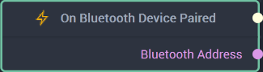

# Overview

The **On Bluetooth Device Paired Node** signals that a *Bluetooth* device was paired successfully.

**Bluetooth Communication** in **Incari** is available as a plugin and is enabled as default. However, in the case that it is disabled in the **Plugins Editor**, **On Bluetooth Device Paired** will not show up in the [**Toolbox**](../../../overview.md). Please refer to the [**Plugins Editor**](../../../../modules/plugins/README.md) to find out more information.

[**Scope**](../../../overview.md#scopes): **Project**, **Scene**.

# Outputs

|Output|Type|Description|
|---|---|---|
|*Pulse Output* (►)|**Pulse**|A standard **Output Pulse**, to move onto the next **Node** along the **Logic Branch**, once this **Node** has finished its execution.|
|`Bluetooth Address`|**String**|The *Bluetooth* address of the paired device.|

# See Also

* [**On Bluetooth Device Unpaired**](onbluetoothdeviceunpaired.md)

