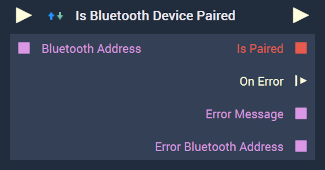

# Overview

The **Is Bluetooth Device Paired Node** checks the pairing status of a *Bluetooth* device to the [**Bluetooth Plugin**](../../../modules/plugins/communication/bluetooth.md).

The **Node** only schedules the 'is paired' checking process and then returns immediately. This means that it is possible to trigger the **Node** multiple times with different inputs, resulting in consecutive checking attempts. This is the reason for returning the error *Bluetooth* address, as it properly attributes the error to the relevant device. 

**Bluetooth Communication** in **Incari** is available as a plugin and is enabled as default. However, in the case that it is disabled in the **Plugins Editor**, it will not appear in the **Project Settings** and **Is Bluetooth Device Paired** will not show up in the [**Toolbox**](../../overview.md). Please refer to the [**Plugins Editor**](../../../modules/plugins/README.md) to find out more information.

[**Scope**](../../overview.md#scopes): **Project**, **Scene**.

# Inputs

|Input|Type|Description|
|---|---|---|
|*Pulse Input* (►)|**Pulse**|A standard **Input Pulse**, to trigger the execution of the **Node**.|
|`Bluetooth Address`|**String**|The unique *Bluetooth* identifier that is associated with a *Bluetooth* device.|

# Outputs

|Output|Type|Description|
|---|---|---|
|*Pulse Output* (►)|**Pulse**|A standard **Output Pulse**, to move onto the next **Node** along the **Logic Branch**, once this **Node** has finished its execution.|
|`On Finish`(►)|**Pulse**|An **Event Pulse** which is triggered if pairing has finished.|
|`Is Paired`|**Bool**|Returns *true* if the device is paired and *false* if not.|
|`Bluetooth Address`|**String**|The **Bluetooth** address of the device.|
|`On Error`(►)|**Pulse**|An **Event Pulse** that fires in the event of an error.|
|`Error Message`|**String**|The error message in the event of an error.|
|`Bluetooth Address`|**String**|The *Bluetooth* address associated with the error.|

