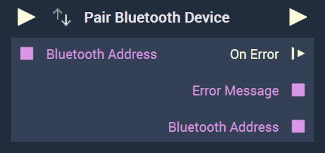
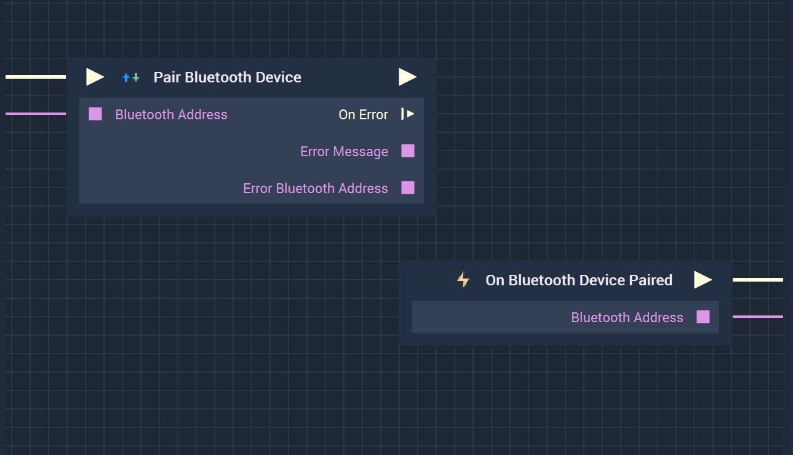

# Overview

The **Pair Bluetooth Device Node** attempts to pair a given *Bluetooth* device that may have been previously discovered by the [**Scan For Bluetooth Devices Node**](scanforbluetoothdevices.md). A more detailed explanation of this process can be found [here](README.md#bluetooth-guideline).

The **Node** only schedules the pairing process and then returns immediately. This means that it is possible to trigger the **Node** multiple times with different inputs, resulting in consecutive pairing attempts. This is the reason for returning the error *Bluetooth* address, as it properly attributes the error to the relevant device. 

**Bluetooth Communication** in **Incari** is available as a plugin and is enabled as default. However, in the case that it is disabled in the **Plugins Editor**, **Pair Bluetooth Device** will not show up in the [**Toolbox**](../../overview.md). Please refer to the [**Plugins Editor**](../../../modules/plugins/README.md) to find out more information.

It is important to note that while the **Pair Bluetooth Device** connects to a **Bluetooth** device (like a phone), it will not finish pairing when the **Node** is executed. This will lead to the **Logic** attached to its **Output Pulse** not to work even though there is technically nothing wrong. In order to avoid this, it is necessary to use the [**On Bluetooth Device Paired Node**](events/onbluetoothdevicepaired.md) instead. This way, the **Logic** will only execute once the **Bluetooth** device has definitely been paired with.

Again, the user must first use the **Pair Bluetooth Device Node** to pair with a device. Separately, the **On Bluetooth Device Paired Node** can be used to execute the desired **Communication Logic**.

[**Scope**](../../overview.md#scopes): **Project**, **Scene**.

# Inputs

|Input|Type|Description|
|---|---|---|
|*Pulse Input* (►)|**Pulse**|A standard **Input Pulse**, to trigger the execution of the **Node**.|
|`Bluetooth Address`|**String**|The unique *Bluetooth* identifier that is associated with a *Bluetooth* device. This can be discovered by the [**Scan For Bluetooth Devices Node**](scanforbluetoothdevices.md).|

# Outputs

|Output|Type|Description|
|---|---|---|
|*Pulse Output* (►)|**Pulse**|A standard **Output Pulse**, to move onto the next **Node** along the **Logic Branch**, once this **Node** has finished its execution.|
|`On Error`(►)|**Pulse**|An **Event Pulse** that fires in the event of an error, namely that pairing failed.|
|`Error Message`|**String**|The error message in the event of an error.|
|`Bluetooth Address`|**String**|The *Bluetooth* address of the device for which the pairing failed, in the event of an error.|

# See Also

* [**Unpair Bluetooth Devices**](unpairbluetoothdevices.md)

