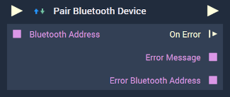

# Overview

The **Pair Bluetooth Device Node** attempts to pair a given *Bluetooth* device.

[**Scope**](../../overview.md#scopes): **Project**, **Scene**.

# Inputs

|Input|Type|Description|
|---|---|---|
|*Pulse Input* (►)|**Pulse**|A standard **Input Pulse**, to trigger the execution of the **Node**.|
|`Bluetooth Address`|**String**|The unique *Bluetooth* identifier that is associated with a *Bluetooth* device.|

# Outputs

|Output|Type|Description|
|---|---|---|
|*Pulse Output* (►)|**Pulse**|A standard **Output Pulse**, to move onto the next **Node** along the **Logic Branch**, once this **Node** has finished its execution.|
|`On Error`(►)|**Pulse**|An **Event Pulse** that fires in the event of an error, namely that pairing failed.|
|`Error Message|**String**|The error message in the event of an error.|
|`Error Bluetooth Address`|**String**|The *Bluetooth* address associated with the error.|

# See Also

* [**Unpair Bluetooth Devices**](unpairbluetoothdevices.md)

