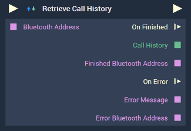

# Overview

The **Retrieve Call History Node** returns a device's call history in **Dictionary** form. The keys are `IncomingCalls`, `OutgoingCalls`, `CanceledCalls`, and `MissedCalls`. 

[**Scope**](../../overview.md#scopes): **Project**, **Scene**.

# Inputs

|Input|Type|Description|
|---|---|---|
|*Pulse Input* (►)|**Pulse**|A standard **Input Pulse**, to trigger the execution of the **Node**.|
|`Bluetooth Address`|**String**|The unique *Bluetooth* identifier that is associated with a *Bluetooth* device.|

# Outputs

|Output|Type|Description|
|---|---|---|
|*Pulse Output* (►)|**Pulse**|A standard **Output Pulse**, to move onto the next **Node** along the **Logic Branch**, once this **Node** has finished its execution.|
|`On Finished`(►)|**Pulse**|An **Event Pulse** which is triggered if the call history was successfully retrieved.|
|`Call History`|**Dictionary**|The **Dictionary** containing the device's call history.|
|`Finished Bluetooth Address`|**String**|The **Bluetooth** address of the device.|
|`On Error`(►)|**Pulse**|An **Event Pulse** that fires in the event of an error, namely that the retrieval of the call history was unsuccessful.|
|`Error Message`|**String**|The error message in the event of an error.|
|`Error Bluetooth Address`|**String**|The *Bluetooth* address associated with the error.|