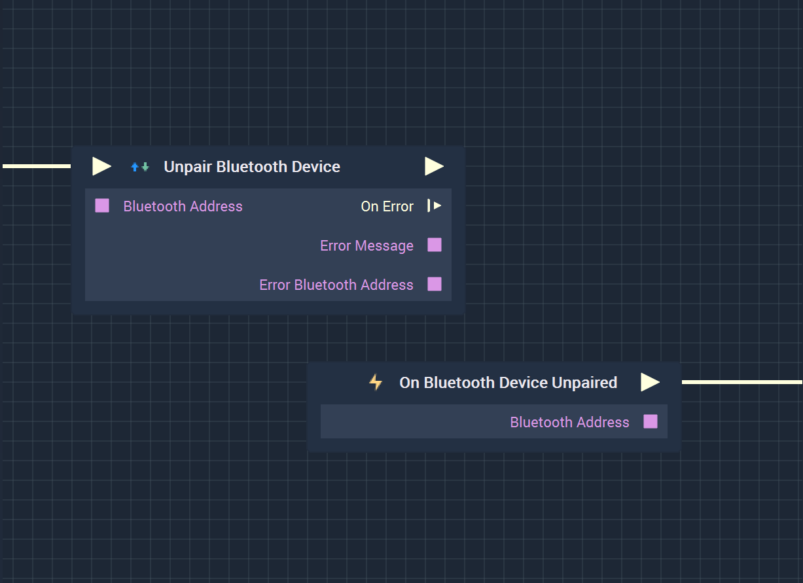

# Overview

**Unpair Bluetooth Device** attempts to unpair a given *Bluetooth* device.

**Bluetooth Communication** in **Incari** is available as a plugin and is enabled as default. However, in the case that it is disabled in the **Plugins Editor**, it will not appear in the **Project Settings** and **Unpair Bluetooth Device** will not show up in the [**Toolbox**](../../overview.md). Please refer to the [**Plugins Editor**](../../../modules/plugins/README.md) to find out more information.

It is important to note that while the **Unpair Bluetooth Device** disconnects from a **Bluetooth** device (like a phone), it may not completely finish unpairing when the **Node** is executed. This could lead to the **Logic** attached to its **Output Pulse** to not work even though there is technically nothing wrong. In order to avoid this, it is highly suggested to use the [**On Bluetooth Device Unpaired Node**](events/onbluetoothdevicepaired.md) instead. This way, the **Logic** will only execute once the **Bluetooth** device has definitely been paired with.

Again, the user must first use the **Unpair Bluetooth Device Node** to unpair from a device. Separately, the **On Bluetooth Device Unpaired Node** can be used to execute the desired **Communication Logic**.

[**Scope**](../../overview.md#scopes): **Project**, **Scene**.

# Inputs

|Input|Type|Description|
|---|---|---|
|*Pulse Input* (►)|**Pulse**|A standard **Input Pulse**, to trigger the execution of the **Node**.|
|`Bluetooth Address`|**String**|The unique *Bluetooth* identifier that is associated with a *Bluetooth* device.|

# Outputs

|Output|Type|Description|
|---|---|---|
|*Pulse Output* (►)|**Pulse**|A standard **Output Pulse**, to move onto the next **Node** along the **Logic Branch**, once this **Node** has finished its execution.|
|`On Error`(►)|**Pulse**|An **Event Pulse** that fires in the event of an error, namely that unpairing failed.|
|`Error Message`|**String**|The error message in the event of an error.|
|`Error Bluetooth Address`|**String**|The *Bluetooth* address associated with the error.|

# See Also

* [**Pair Bluetooth Device**](pairbluetoothdevices.md)
