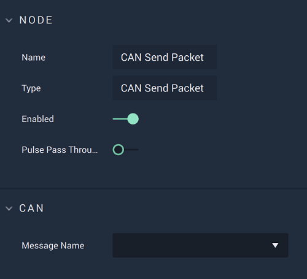
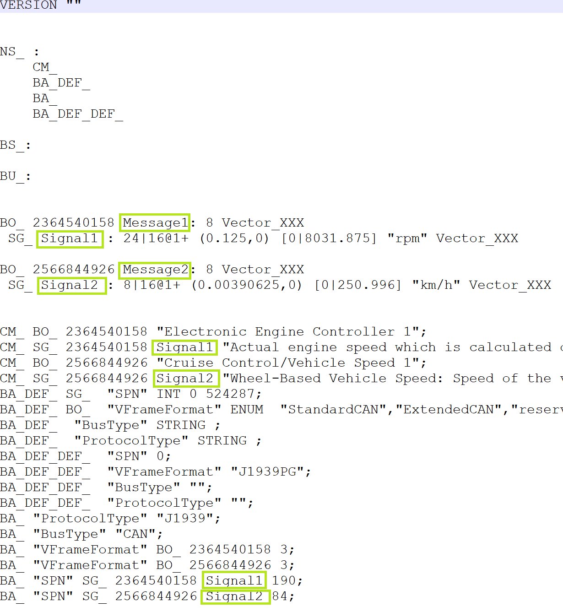
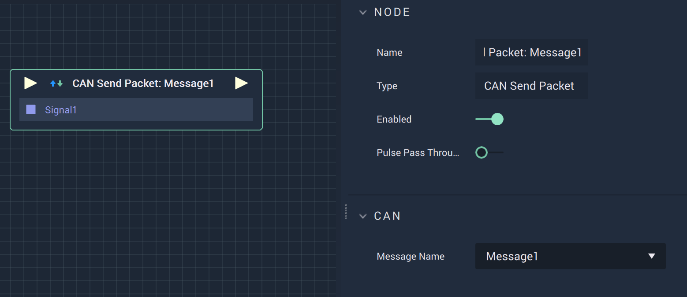

# CAN Send Packet

## Overview

The **CAN Send Packet Node** is used to send a data **Packet** along the **CAN** network, once a **CAN** `Message` is selected from the **Drop-down Menu**.

[**Scope**](../overview.md#scopes): **Project**, **Scene**, **Function**, **Prefab**.

## Attributes

| Attribute | Type | Description |
| :--- | :--- | :--- |
| `Message Name` | **Drop-down** | The selected `Message` from the uploaded _DBC_ file. |

## Inputs

| Input | Type | Description |
| :--- | :--- | :--- |
| _Pulse Input_ \(►\) | **Pulse** | A standard **Input Pulse**, to trigger the execution of the **Node**. |
|`Signal [n]`|**Float**|The *Signal* or *Signals* of a *Message* from the specified *DBC* file.|

## Outputs

| Output | Type | Description |
| :--- | :--- | :--- |
| _Pulse Output_ \(►\) | **Pulse** | A standard **Output Pulse**, to move onto the next **Node** along the **Logic Branch**, once this **Node** has finished its execution. |

## Example

To visualize how the **Node** works a bit better, refer to the images below. The first is an example *DBC* file, which would have been added in the **CAN Project Settings**. There are two *Messages* and two *Signals*, each of which correspond to one of the *Messages*. 

When the connection has been added in **Project Settings** and those changes are saved, the user can select the desired `Message Name` -- here Message1 -- which will make an input appear called `Signal1`. If a *Message* has multiple *Signals* -- for example if Message1 had two *Signals* called Signal1a and Signal1b -- all appear as inputs of the **Node**. 

## See Also

* [**CAN Start**](canstart.md)
* [**CAN Stop**](canstop.md)

## External Links

* The example [*DBC* file.](https://www.csselectronics.com/pages/can-dbc-file-database-intro)