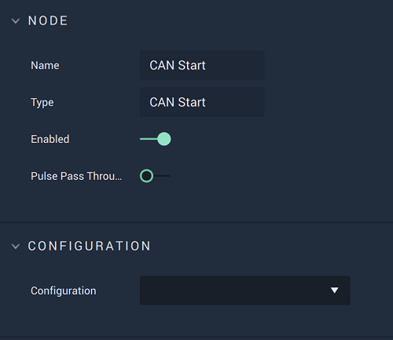

# CAN Start

## Overview

The **CAN Start Node** starts communication with a **CAN** connection that has already been set up in [**Project Settings**](../../../modules/project-settings/CAN.md).

It is important to note that while the **CAN Start Node** starts a **CAN** connection, it may not completely finish establishing said connection when the **Node** is executed. This could lead to the **Logic** attached to its **Output Pulse** to not work even though there is technically nothing wrong. In order to avoid this, it is highly suggested to use the [**On CAN Start Node**](events/oncanstart.md) instead. This way, the **Logic** will only execute once the **CAN** connection has definitely been established.

Again, the user must first use the **CAN Start Node** to open the connection. Separately, the **On CAN Start Node** can be used to execute the desired **Communication Logic**.

[**Scope**](../overview.md#scopes): **Project**, **Scene**.

## Attributes

| Attribute       | Type          | Description                                                                                                                                              |
| --------------- | ------------- | -------------------------------------------------------------------------------------------------------------------------------------------------------- |
| `Configuration` | **Drop-down** | The identifying connection name that will be used, which is one that was set up in the [**Project Settings**](../../../modules/project-settings/CAN.md). |

## Inputs

| Input             | Type      | Description                                                           |
| ----------------- | --------- | --------------------------------------------------------------------- |
| _Pulse Input_ (►) | **Pulse** | A standard **Input Pulse**, to trigger the execution of the **Node**. |

## Outputs

| Output             | Type      | Description                                                                                                                            |
| ------------------ | --------- | -------------------------------------------------------------------------------------------------------------------------------------- |
| _Pulse Output_ (►) | **Pulse** | A standard **Output Pulse**, to move onto the next **Node** along the **Logic Branch**, once this **Node** has finished its execution. |

## See Also

* [**CAN Stop**](canstop.md)
* [**CAN Send Packet**](cansendpacket.md)
