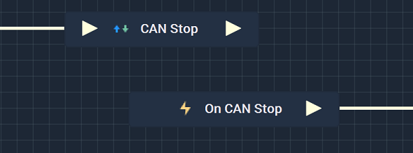

# CAN Stop

## Overview

The **CAN Stop Node** halts communication with a **CAN** network.

It is important to note that while the **CAN Stop Node** stops a **CAN** connection, it may not completely finish disconnecting from said connection when the **Node** is executed. This could lead to the **Logic** attached to its **Output Pulse** 
to not work even though there is technically nothing wrong. In order to avoid this, it is highly suggested to use 
the [**On CAN Stop Node**](events/oncanstop.md) instead. This way, the **Logic** will only execute once the **CAN** connection has definitely been disconnected from. 

Again, the user must first use the **CAN Stop Node** to close the connection. Separately, the **On CAN Stop Node** can be used to execute the desired **Communication Logic**. 

[**Scope**](../overview.md#scopes): **Project**, **Scene**, **Function**, **Prefab**.

## Inputs

| Input | Type | Description |
| :--- | :--- | :--- |
| _Pulse Input_ \(►\) | **Pulse** | A standard **Input Pulse**, to trigger the execution of the **Node**. |

## Outputs

| Output | Type | Description |
| :--- | :--- | :--- |
| _Pulse Output_ \(►\) | **Pulse** | A standard **Output Pulse**, to move onto the next **Node** along the **Logic Branch**, once this **Node** has finished its execution. |

## See Also

* [**CAN Start**](canstart.md)
* [**CAN Send Packet**](cansendpacket.md)

