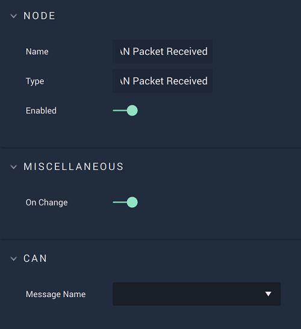

# On CAN Packet Received

## Overview

**On CAN Packet Received** is an **Event Listener Node** allowing the user to perform an action once a **CAN** `Message` is selected from the **Drop-down Menu** and a data **Packet** has been received.

[**Scope**](../overview.md#scopes):
*  **Project**, **Scene**

## Attributes

| Attribute | Type | Description |
| :--- | :--- | :--- |
| `On Change` | **Bool** | Returns true or false depending on whether or not the user wants to modify the `Message Name`. |
| `Message Name` | **Drop-down** | A `Message` that is chosen from the uploaded _DBC_ file. This is done in **Project Settings**. |

## Outputs

| Output | Type | Description |
| :--- | :--- | :--- |
| _Pulse Output_ \(►\) | **Pulse** | A standard **Output Pulse**, to move onto the next **Node** along the **Logic Branch**, once this **Node** has finished its execution. |

## See Also

* [**On CAN Start**](oncanstart.md)
* [**On CAN Stop**](oncanstop.md)

