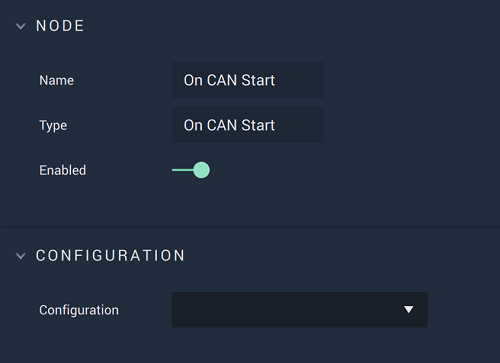

# On CAN Start

## Overview

**On CAN Start** is an **Event Listener Node** notifying that the **CAN** connection was successfully established, therefore enabling the user to perform actions on said connection.

[**Scope**](../../overview.md#scopes): **Project**, **Scene**.

## Attributes

| Attribute | Type | Description |
| :--- | :--- | :--- |
| `Configuration` | **Drop-down** | The identifying connection name that will be used. |

## Outputs

| Output | Type | Description |
| :--- | :--- | :--- |
| _Pulse Output_ \(►\) | **Pulse** | A standard **Output Pulse**, to move onto the next **Node** along the **Logic Branch**, once this **Node** has finished its execution. |

## See Also

* [**On CAN Packet Received**](oncanpacketreceived.md)
* [**On CAN Stop**](oncanstop.md)

