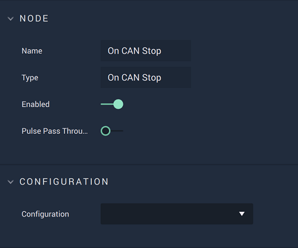

# On CAN Stop

## Overview

**On CAN Stop** is an **Event Listener Node** allowing the user to perform an action once a **CAN** process has ended.

[**Scope**](../../overview.md#scopes): **Project**, **Scene**.

## Attributes

| Attribute | Type | Description |
| :--- | :--- | :--- |
| `Configuration` | **Drop-down** | The identifying connection name that will be used, which is one that was set up in the [**Project Settings**](../../../../modules/project-settings/CAN.md). |

## Outputs

| Output | Type | Description |
| :--- | :--- | :--- |
| _Pulse Output_ \(►\) | **Pulse** | A standard **Output Pulse**, to move onto the next **Node** along the **Logic Branch**, once this **Node** has finished its execution. |

## See Also

* [**On CAN Start**](oncanstart.md)
* [**On CAN Packet Received**](oncanpacketreceived.md)

