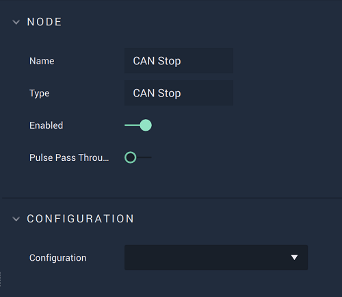

# CANopen Send

This **Node** has different versions depending on which `Protocol` is selected. This can be either *PDO* or *SDO*. Find in the tabs below the documentation for both versions.



#### Overview

The **CANopen Send Node** is used to send a message once a **CANopen** connection has been selected from the **Drop-down Menu**. Here, the *PDO* `protocol` has been chosen. 

[**Scope**](../overview.md#scopes): **Project**, **Scene**.

# Attributes

|Attribute|Type|Description|
|---|---|---|
|`Configuration`|**Drop-down**|The identifying connection name that will be used, which has already been set up in the [Project Settings](../../../modules/project-settings/CANopen.md). |
|`Protocol`|**Drop-down**|The desired protocol to use when sending the message. Here, `PDO` has been chosen. After selecting this, `Index` and `Subindex` will provide values. |
|`Index`|**Drop-down**|The index of the signal. Values depend on which `Protocol` has been selected.|
|`Subindex`|**Drop-down**|The subindex of the signal. Values depend on which `Index` has been selected.|
|`Value Type`|**Defined by previous selections**|The value type to be sent which is determined by which `Index` and `Subindex` have been chosen. For *PDO*, the types are **Bool** or **Int**.|

# Inputs

|Input|Type|Description|
|---|---|---|
|*Pulse Input* (►)|**Pulse**|A standard **Input Pulse**, to trigger the execution of the **Node**.|
|`Value`|**Any (Defined by previous selections)**|The value to be sent.|

# Outputs

|Output|Type|Description|
|---|---|---|
|*Pulse Output* (►)|**Pulse**|A standard **Output Pulse**, to move onto the next **Node** along the **Logic Branch**, once this **Node** has finished its execution.|


#### Overview

The **CANopen Send Node** is used to send a message once a **CANopen** connection has been selected from the **Drop-down Menu**. Here, the *SDO* `Protocol` has been chosen. 

[**Scope**](../overview.md#scopes): **Project**, **Scene**.

# Attributes

|Attribute|Type|Description|
|---|---|---|
|`Configuration`|**Drop-down**|The identifying connection name that will be used, which has already been set up in the [Project Settings](../../../modules/project-settings/CANopen.md). |
|`Protocol`|**Drop-down**|The desired protocol to use when sending the message. Here, `SDO` has been chosen. After selecting this, `Index` and `Subindex` will provide values. |
|`Index`|**Drop-down**|The index of the signal. Values depend on which `Protocol` has been selected.|
|`Subindex`|**Drop-down**|The subindex of the signal. Values depend on which `Index` has been selected.|
|`Value Type`|**Defined by previous selections**|The value type to be sent which is determined by which `Index` and `Subindex` have been chosen. For *PDO*, the types are **Bool**, **Int**, **Float**, **String**, or **Binary**.|

# Inputs

|Input|Type|Description|
|---|---|---|
|*Pulse Input* (►)|**Pulse**|A standard **Input Pulse**, to trigger the execution of the **Node**.|
|`Value`|**Any (Defined by previous selections)**|The value to be sent.|

# Outputs

|Output|Type|Description|
|---|---|---|
|*Pulse Output* (►)|**Pulse**|A standard **Output Pulse**, to move onto the next **Node** along the **Logic Branch**, once this **Node** has finished its execution.|

# See Also

* [**CANopen Start**](canopenstart.md)
* [**CANopen Stop**](canopenstop.md)

# External Links

* Explanation of [*PDO and SDO*](https://community.element14.com/learn/learning-center/the-tech-connection/w/documents/4195/how-does-the-canopen-network-protocol-work).

