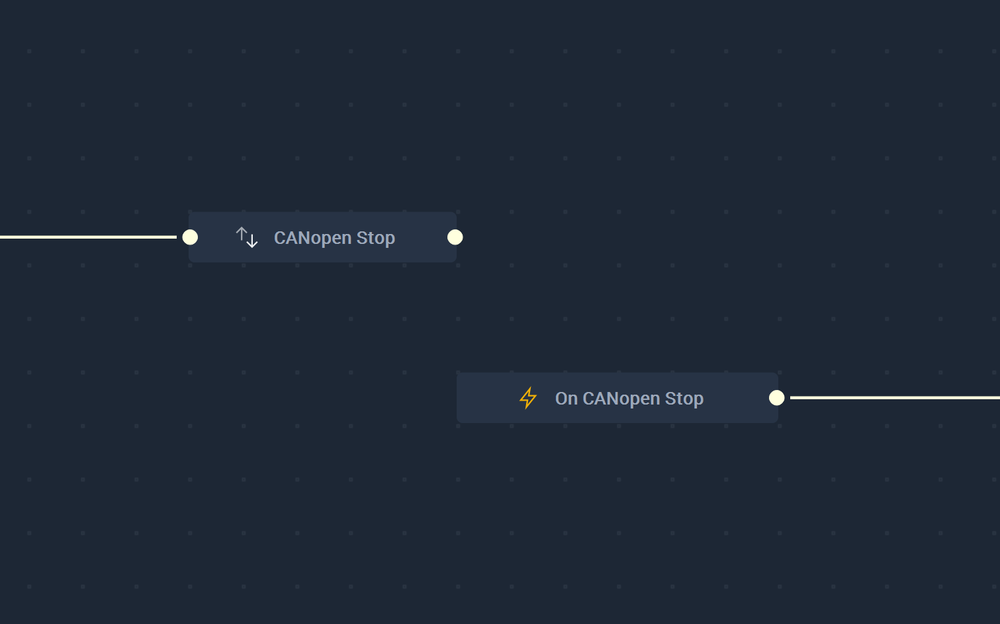
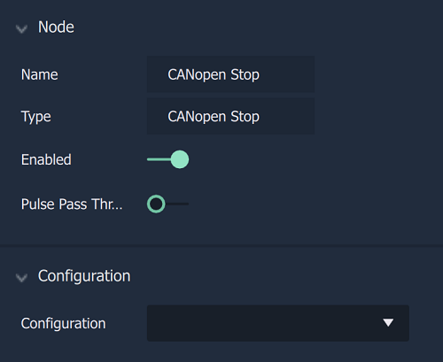

# Overview

The **CANopen Stop Node** halts communication with a **CANopen** connection.

It is important to note that while the **CANopen Stop Node** stops a **CANopen** connection, it may not completely finish disconnecting from said connection when the **Node** is executed. This could lead to the **Logic** attached to its **Output Pulse** 
to not work even though there is technically nothing wrong. In order to avoid this, it is highly suggested to use 
the [**On CANopen Stop Node**](events/oncanopenstop.md) instead. This way, it is assured that the **Logic** will execute once the connection to the **CANopen** connection has been terminated.

Again, the user must first use the **CANopen Stop Node** to close the connection. Separately, the **On CANopen Stop Node** can be used to execute the desired **Communication Logic**. 

[**Scope**](../overview.md#scopes): **Project**, **Scene**.

# Attributes

|Attribute|Type|Description|
|----------|---|---|
|`Configuration`|**Drop-down**|The identifying connection name that will be used, which has already been set up in the [**Project Settings**](../../../modules/project-settings/CANopen.md).|

# Inputs

|Input|Type|Description|
|---|---|---|
|*Pulse Input* (►)|**Pulse**|A standard **Input Pulse**, to trigger the execution of the **Node**.|

# Outputs

|Output|Type|Description|
|---|---|---|
|*Pulse Output* (►)|**Pulse**|A standard **Output Pulse**, to move onto the next **Node** along the **Logic Branch**, once this **Node** has finished its execution.|

# See Also

* [**CANopen Start**](canopenstart.md)
* [**CANopen Send**](canopensend.md)

