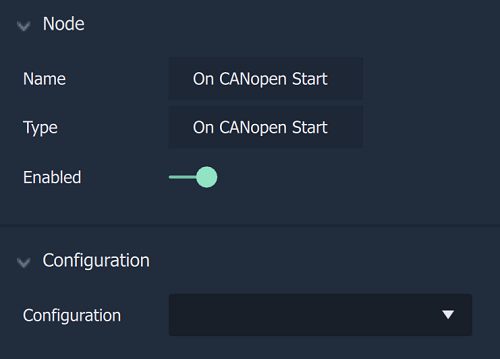

# Overview

The **On CANopen Start Node** is an **Event Listener Node** notifying that the **CANopen** connection was successfully established, therefore enabling the user to perform actions on said connection. 

[**Scope**](../overview.md#scopes): **Project**, **Scene**.

# Attributes

|Attribute|Type|Description|
|---|---|---|
|`Configuration`|**Drop-down**|The identifying connection name that will be used, which has already been set up in the [**Project Settings**](../../../../modules/project-settings/CANopen.md).|

# Outputs

|Output|Type|Description|
|---|---|---|
|*Pulse Output* (►)|**Pulse**|A standard **Output Pulse**, to move onto the next **Node** along the **Logic Branch**, once this **Node** has finished its execution.|

# See Also

* [**On CANopen Receive**](oncanopenreceive.md)
* [**On CANopen Stop**](oncanopenstop.md)
  

