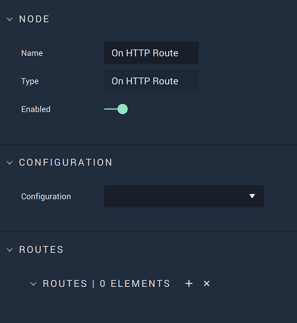

# On HTTP Route

## Overview

**On HTTP Route** is an **Event Listener Node** that executes when a `Route` is received and returns the data defined by the outputs.

[**Scope**](../../overview.md#scopes): **Project**, **Scene**.

## Attributes

| Attribute | Type | Description |
| :--- | :--- | :--- |
| `Configuration` | **Drop-down** | The desired _HTTP_ server. |
| `Routes` | **Add Elements** | A `Route` is made up of its _HTTP_ `Method` \(either **GET** or **POST**\) and its URL. |

## Outputs

| Output | Type | Description |
| :--- | :--- | :--- |
| _Pulse Output_ \(►\) | **Pulse** | A standard **Output Pulse**, to move onto the next **Node** along the **Logic Branch**, once this **Node** has finished its execution. |
| `Headers` | **Dictionary** | _HTTP_ headers in the form of key/value pairs. |
| `Query` | **Dictionary** | Parameters of the call in the form of key/value pairs. |
| `Request ID` | **CustomID** | The unique ID of the request. |

