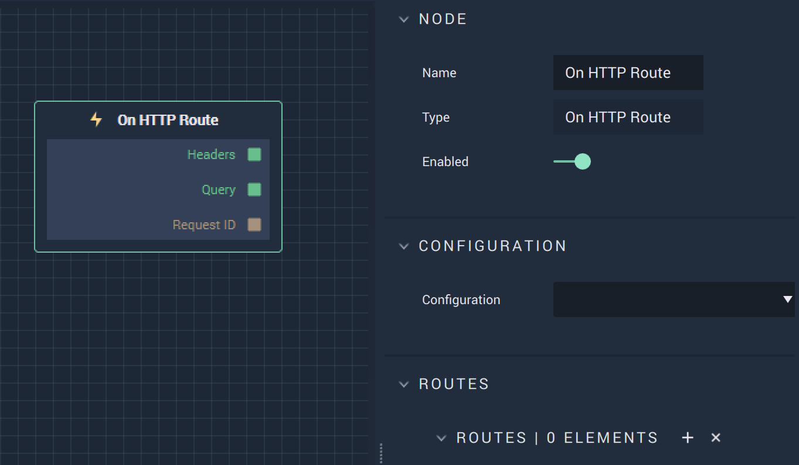

# Overview

**On HTTP Route** is an **Event Listener Node** that executes when a `Route` is received and returns the data defined by the outputs.

# Attributes

|Attribute|Type|Description|
|---|---|---|
|`Configuration`|**Dropdown**|The desired *HTTP* server.|
|`Routes`|**Add Elements**|A `Route` is made up of its *HTTP* `Method` (either GET or POST) and its URL.|

# Outputs

|Output|Type|Description|
|---|---|---|
|*Pulse Output* (►)|**Pulse**|A standard **Output Pulse**, to move onto the next **Node** along the **Logic Branch**, once this **Node** has finished its execution.|
|`Headers`|**Dictionary**|*HTTP* headers in the form of key/value pairs.|
|`Query`|**Dictionary**|Parameters of the call in the form of key/value pairs.|
|`Request ID`|**CustomID**|The unique ID of the request.|

