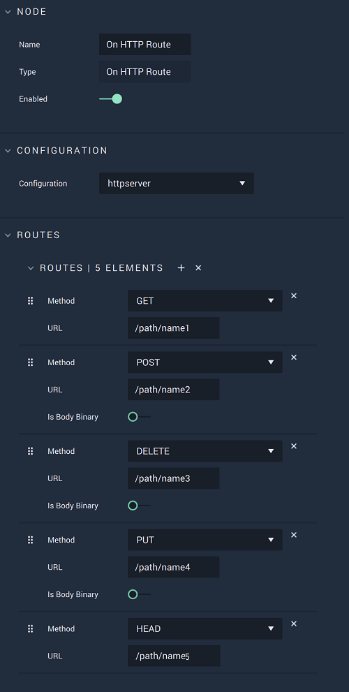
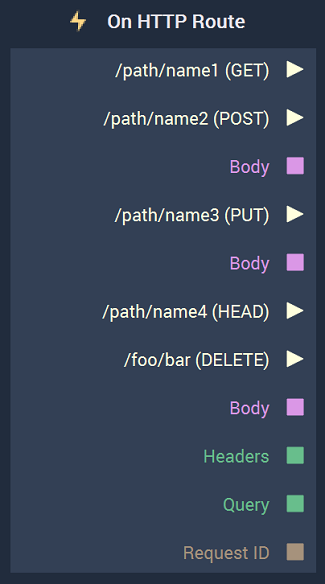

# On HTTP Route

## Overview

**On HTTP Route** is an **Event Listener Node** that executes when a `Request` is received  by a specific **Route**, which is set up in the `Attributes`, and returns the data defined by the outputs. A **Route** is made up of a `Method` and `URL`.  

The **Node** changes with each **Route** added. Please refer to the [example](onhttproute.md#example) for more information. 

[**Scope**](../../overview.md#scopes): **Project**, **Scene**.

## Attributes

| Attribute | Type | Description |
| :--- | :--- | :--- |
| `Configuration` | **Drop-down** | The desired _HTTP_ server, which refers back to the selections made under *HTTP* in the [**Project Settings**](../../../modules/project-settings.md). |
| `Routes` | **Add Elements** | A `Route` is made up of its _HTTP_ `Method` \(either **GET**, **POST**, **DELETE**, **PUT**, or **HEAD**\) and its URL. |
|`Is Body Binary`|**Bool**|The user chooses true or false depending on whether they wish for the `Body` output to remain a **String** or be converted into *binary*. This **Attribute** is only available for the `Methods` **POST**, **PUT**, and **DELETE**.|

## Outputs

| Output | Type | Description |
| :--- | :--- | :--- |
| `path/name (METHOD)` \(►\) |**Output Pulse**| An **Output Pulse** which appears when a **Route** is created and a `Method` is chosen. It executes when a `Request` is received by the **Route**. Since it is possible to have multiple **Routes**, it is possible to have multiple **Output Pulses**.|
| `Headers` | **Dictionary** | _HTTP_ headers in the form of key/value pairs. |
| `Query` | **Dictionary** | Parameters of the call in the form of key/value pairs. |
| `Request ID` | **CustomID** | The unique ID of the request, which can then be used by [**HTTP Response**](../httpresponse.md). |
|`Body`| **String** | The body of the response, usually including _HTML_ text. This **Attribute** is only available for the `Methods` **POST**, **PUT**, and **DELETE**.|

## Example

To better demonstrate the differences between the `Methods` and how that translates to changes in the **Node**, please refer to the following image:

Every `Method`creates a new **Output Pulse** for that specific `Method`, along with the provided *URL* given in the **Attributes** section. If there are multiple `Methods`, some **Outputs** are shared. These are `Headers`, `Query`, and `Request ID`, which appear at the bottom of the **Node**. For the `Methods` that return the **String Output** `Body`, a separate `Body` **Output** is created for each. 

## External Links

* [Different *HTTP* Methods](https://www.w3schools.com/tags/ref_httpmethods.asp) on W3Schools.
