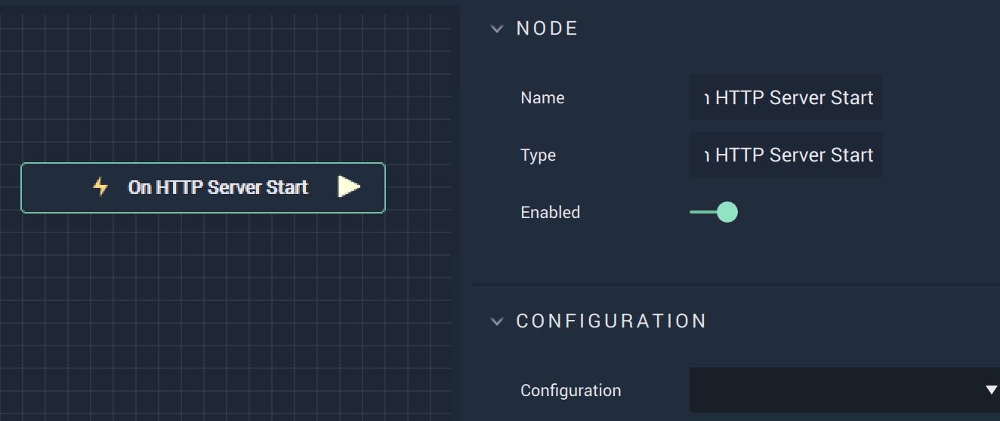

# On HTTP Server Start

## Overview

**On HTTP Server Start** is an **Event Listener Node** allowing the user to perform an action once a connection to an **HTTP** server has been made.

## Attributes

| Attribute | Type | Description |
| :--- | :--- | :--- |
| `Configuration` | **Drop-down** | The desired _HTTP_ server. |

## Outputs

| Output | Type | Description |
| :--- | :--- | :--- |
| _Pulse Output_ \(►\) | **Pulse** | A standard **Output Pulse**, to move onto the next **Node** along the **Logic Branch**, once this **Node** has finished its execution. |

## See Also

* [**On HTTP Server Stop**](onhttpserverstop.md)

