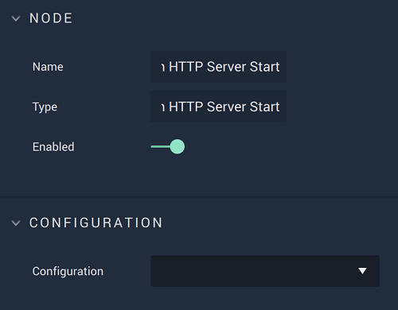

# On HTTP Server Start

## Overview

**On HTTP Server Start** is an **Event Listener Node** notifying that the **HTTP** connection was successfully established, therefore enabling the user to perform actions on said connection to the *HTTP* server.

[**Scope**](../../overview.md#scopes): **Project**, **Scene**.

## Attributes

| Attribute | Type | Description |
| :--- | :--- | :--- |
| `Configuration` | **Drop-down** | The desired _HTTP_ server, which refers back to the selections made under *HTTP* in the [**Project Settings**](../../../modules/project-settings.md). |

## Outputs

| Output | Type | Description |
| :--- | :--- | :--- |
| _Pulse Output_ \(►\) | **Pulse** | A standard **Output Pulse**, to move onto the next **Node** along the **Logic Branch**, once this **Node** has finished its execution. |

## See Also

* [**On HTTP Server Stop**](onhttpserverstop.md)

