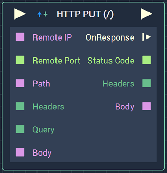
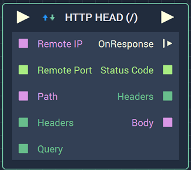
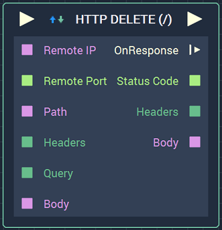

# HTTP Client

## Overview

<figure><figcaption>
GET.
</figcaption></figure>
<figure><figcaption>
POST.
</figcaption></figure>

<figure><figcaption>
PUT.
</figcaption></figure>
<figure><figcaption>
HEAD.
</figcaption></figure>
<figure><figcaption>
DELETE.
</figcaption></figure>

The **HTTP Client Node** has several `Methods` which allow the user to send requests to a selected server. These are [**GET**](), [**POST**](), [**PUT**](), [**HEAD**](), and [**DELETE**]().

[**Scope**](../overview.md#scopes): **Project**, **Scene**, **Function**, **Prefab**.

### Common Attributes, Inputs, and Outputs
#### Attributes

Depending on the `Method` selected, the **Attributes** and **Inputs** might change. However, there are several common **Attributes**, **Inputs**, and **Outputs** between the many **HTTP** `Methods`.

 

| Attribute | Type | Description |
| :--- | :--- | :--- |
| `Remote IP` | **User Input** | The _HTTP_ endpoint \(either a URL or IP address\). |
| `Remote Port` | **Int** | The port value. For _HTTP_, the standard is 80 and for *HTTPS*, the standard is 443. |
| `Method` | **Drop-down** | Either **GET**,**POST**, **PUT**, **HEAD**, or **DELETE**.|
| `Path` | **User Input** | A specific path from the call being referenced in `Remote IP`. Usually, this is the text after the main root URL but before the `?` character. |
| `Authentication` | **Drop-down** | The user selects `Basic` when a username and password are required to access the information, otherwise `None` is chosen. |
| `Default Headers` | **Add Elements** | _HTTP_ headers in the form of key/value pairs. |
| `Request Query` | **Add Elements** | Parameters of the call in the form of key/value pairs. |
| `Is Response Body Binary` | **Bool** | The user chooses true or false depending on whether the `Response Body` is binary or not. Currently, the **Node** only supports **Strings**. |

#### Inputs

| Input | Type | Description |
| :--- | :--- | :--- |
| _Pulse Input_ \(►\) | **Pulse** | A standard **Input Pulse**, to trigger the execution of the **Node**. |
| `Remote IP` | **String** | The _HTTP_ endpoint \(either a URL or IP address\). |
| `Remote Port` | **Int** | The port value. For _HTTP_, the standard is 80 and for *HTTPS*, the standard is 443. |
| `Path` | **String** | A specific path from the call being referenced in `Remote IP`. Usually, this is the text after the main root URL but before the `?` character. |
| `Headers` | **Dictionary** | _HTTP_ headers in the form of key/value pairs. |
| `Query` | **Dictionary** | Parameters of the call in the form of key/value pairs. |

#### Outputs

| Output | Type | Description |
| :--- | :--- | :--- |
| _Pulse Output_ \(►\) | **Pulse** | A standard **Output Pulse**, to move onto the next **Node** along the **Logic Branch**, once this **Node** has finished its execution. |
| `OnResponse` \(►\) | **Pulse** | Flows to additional actions when there is a response. |
| `Status Code` | **Int** | A standard status code within the _HTTP_ protocol. For example, 404 is when a page is not found. |
| `Headers` | **Dictionary** | Parameters of the call in the form of key/value pairs. |
| `Body` | **String** | The body of the response, usually including _HTML_ text. |

## Methods
### GET

**HTTP GET** creates a request and returns the response as per the _HTTP_ protocol. This is very useful when dealing with web APIs. A more detailed explanation involving web APIs can be found in the **See Also** section. Additional information on the different *HTTP* methods can be found in the **External Links** section.

### POST

**POST** sends data, in this case the information from the `Request Body`, to the desired server as per the _HTTP_ protocol. More information on the different *HTTP* methods can be found in the **External Links** section. All **Attributes** and **Inputs** are the same as the common **Attributes**, except for the addition of the following:

#### Attributes

| Attribute | Type | Description |
| :--- | :--- | :--- |
| `Default Body` | **String** | The body of the _HTTP_ request, if none is provided in the **Input Socket**. |

#### Inputs

| Input | Type | Description |
| :--- | :--- | :--- |
| `Body` | **String** | The body of the _HTTP_ request. |

### HTTP DELETE

**HTTP DELETE** deletes data on the desired server per the *HTTP* protocol. More information on the different *HTTP* methods can be found in the **External Links** section. All **Attributes** and **Inputs** are the same as the common **Attributes**, except for the addition of the following:

#### Attributes

| Attribute | Type | Description |
| :--- | :--- | :--- |
| `Default Body` | **String** | The body of the _HTTP_ request, if none is provided in the **Input Socket**. |

#### Inputs

| Input | Type | Description |
| :--- | :--- | :--- |
| `Body` | **String** | The body of the _HTTP_ request. |
### HTTP PUT

**HTTP PUT** updates already existing data on the desired server per the *HTTP* protocol. More information on the different *HTTP* methods can be found in the **External Links** section. All **Attributes** and **Inputs** are the same as the common **Attributes**, except for the addition of the following:

#### Attributes

| Attribute | Type | Description |
| :--- | :--- | :--- |
| `Default Body` | **String** | The body of the _HTTP_ request, if none is provided in the **Input Socket**. |

#### Inputs

| Input | Type | Description |
| :--- | :--- | :--- |
| `Body` | **String** | The body of the _HTTP_ request. |

### HTTP HEAD

**HTTP HEAD** requests the headers on the desired server in order to gather information about the data, but not the content of the data itself. More information on the different *HTTP* methods can be found in the **External Links** section. All **Attributes** and **Inputs** are the same as those for **HTTP GET**. 

## See Also

* [**Using APIs to Pull Dynamic Data**](../../../demo-projects/using-apis-to-pull-dynamic-data.md)

## External Links

* [Different *HTTP* Methods](https://www.w3schools.com/tags/ref_httpmethods.asp) on W3Schools.

