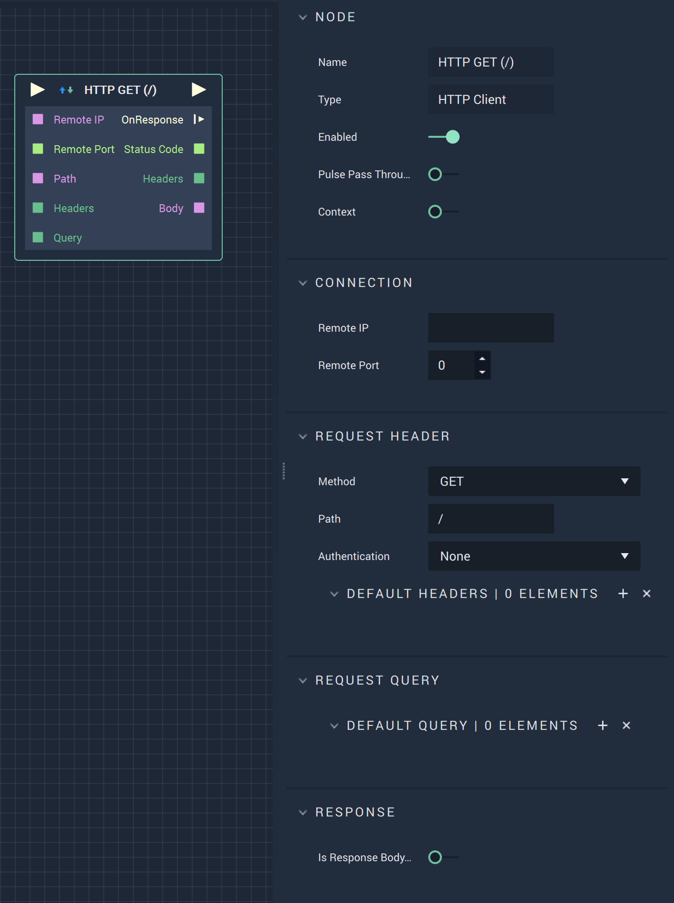
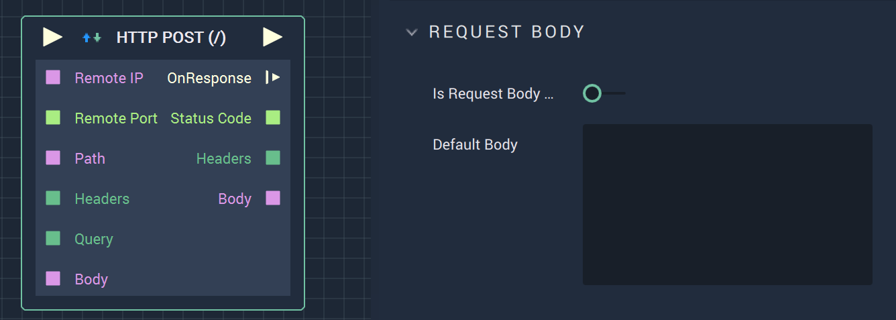

# Overview

The **HTTP Client Node** has two `Methods` of use. These are **HTTP GET** and **HTTP POST**. 

# HTTP GET

**HTTP GET** creates a request and returns the response within the *HTTP* protocol. This is very useful when dealing with APIs. A more detailed explanation involving APIs can be found in the **See Also** section. 

# Attributes

|Attribute|Type|Description|
|---|---|---|
|`Remote IP`|**User Input**|The *HTTP* endpoint (either a URL or IP address).|
|`Remote Port`|**Int**|The port value. For *HTTP*, the standard is 80.|
|`Method`|**Dropdown**|Either **GET** or **POST**, depending on the goal of the user.|
|`Path`|**User Input**|A specific path from the call being referenced in `Remote IP`. Usually, this is the text after the main root URL but before the `?` character.|
|`Authentication`|**Dropdown**|The user selects `Basic` When a username and password are required to access the information, otherwise `None` is chosen.|
|`Default Headers`|**Add Elements**|*HTTP* headers in the form of key/value pairs.|
|`Request Query`|**Add Elements**|Parameters of the call in the form of key/value pairs.|
|`Response`|**Bool**|The user chooses true or false depending on if the response body is binary or not. Currently, the **Node** only supports **Strings**.|

# Inputs

|Input|Type|Description|
|---|---|---|
|*Pulse Input* (►)|**Pulse**|A standard **Input Pulse**, to trigger the execution of the **Node**.|
|`Remote IP`|**String**|The *HTTP* endpoint (either a URL or IP address).|
|`Remote Port`|**Int**|The port value. For *HTTP*, the standard is 80.|
|`Path`|**String**|A specific path from the call being referenced in `Remote IP`. Usually, this is the text after the main root URL but before the `?` character.|
|`Headers`|**Dictionary**|*HTTP* headers in the form of key/value pairs.|
|`Query`|**Dictionary**|Parameters of the call in the form of key/value pairs.|

# Outputs

|Output|Type|Description|
|---|---|---|
|*Pulse Output* (►)|**Pulse**|A standard **Output Pulse**, to move onto the next **Node** along the **Logic Branch**, once this **Node** has finished its execution.|
|`OnResponse` (►)|**Pulse**|Flows to additional actions when there is a response.|
|`Status Code`|**Int**|A standard status code within the *HTTP* protocol. For example, 404 is when a page is not found.|
|`Headers`|**Dictionary**|Parameters of the call in the form of key/value pairs.|
|`Body`|**String**|The body of the response, usually including *HTML* text.|

# HTTP POST

**HTTP POST** sends data, in this case the information from the `Request Body`, to the desired server as per the *HTTP* protocol. More information on the differences between **POST** and **GET** can be found in the **External Links** section. All **Attributes** and **Inputs** are the same as those for **HTTP GET** except for the addition of the following:

# Attributes

|Attribute|Type|Description|
|---|---|---|
|`Request Body`|**User Input**|The body of the *HTTP* request.|

# Inputs

|Input|Type|Description|
|---|---|---|
|`Body`|**String**|The body of the *HTTP* request.|

# See Also

* [**Using APIs to Pull Dynamic Data**](https://docs.incari.com/incari-studio/v/2021.3-unreleased/demo-projects/using-apis-to-pull-dynamic-data#http-get)

# External Links

* [*GET vs POST*](https://www.w3schools.com/tags/ref_httpmethods.asp) on W3Schools.