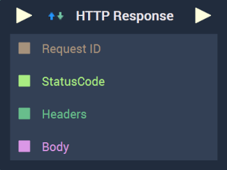
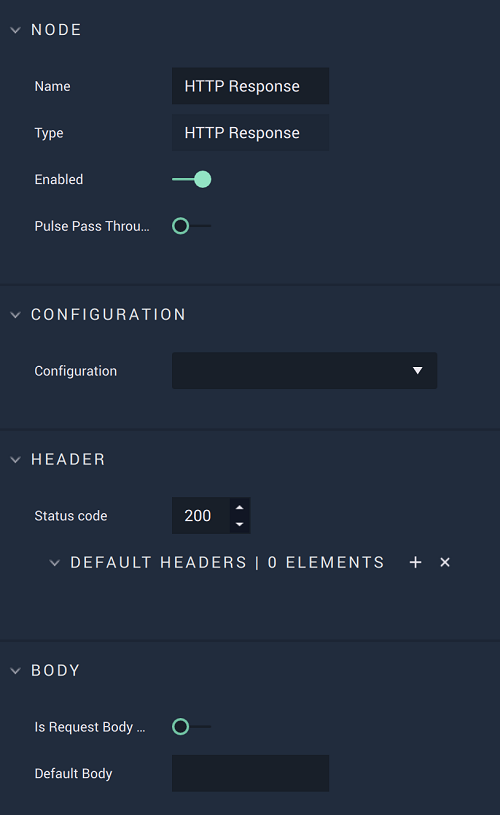

# HTTP Response

## Overview

The **HTTP Response Node** allows the user to define a response to be sent after a request is received and processed.

[**Scope**](../overview.md#scopes): **Project**, **Scene**, **Function**, **Prefab**.

## Attributes

| Attribute | Type | Description |
| :--- | :--- | :--- |
| `Configuration` | **Drop-down** | The desired _HTTP_ server, which refers back to the selections made under *HTTP* in the [**Project Settings**](../../../modules/project-settings.md). |
| `Header` | **Add elements** | Here a status code is entered and _HTTP_ headers, in the form of key/value pairs, are added. |
| `Body` | **User Input** | The body of the response, usually including _HTML_ text. |

## Inputs

| Input | Type | Description |
| :--- | :--- | :--- |
| _Pulse Input_ \(►\) | **Pulse** | A standard **Input Pulse**, to trigger the execution of the **Node**. |
| `Request ID` | **CustomID** | The unique ID of the request, which is required  so that the **Node** knows which client to send the response to. This ID can be obtained from the [**On HTTP Route Node**](events/onhttproute.md).|
| `StatusCode` | **Int** | A standard status code within the _HTTP_ protocol. For example, 404 is when a page is not found. |
| `Headers` | **Dictionary** |  _HTTP_ headers in the form of key/value pairs. |
| `Body` | **String** | The body of the response, usually including _HTML_ text. |

## Outputs

| Output | Type | Description |
| :--- | :--- | :--- |
| _Pulse Output_ \(►\) | **Pulse** | A standard **Output Pulse**, to move onto the next **Node** along the **Logic Branch**, once this **Node** has finished its execution. |

## External Links

* [_HTTP Responses_](https://www.toolsqa.com/client-server/http-response/)

