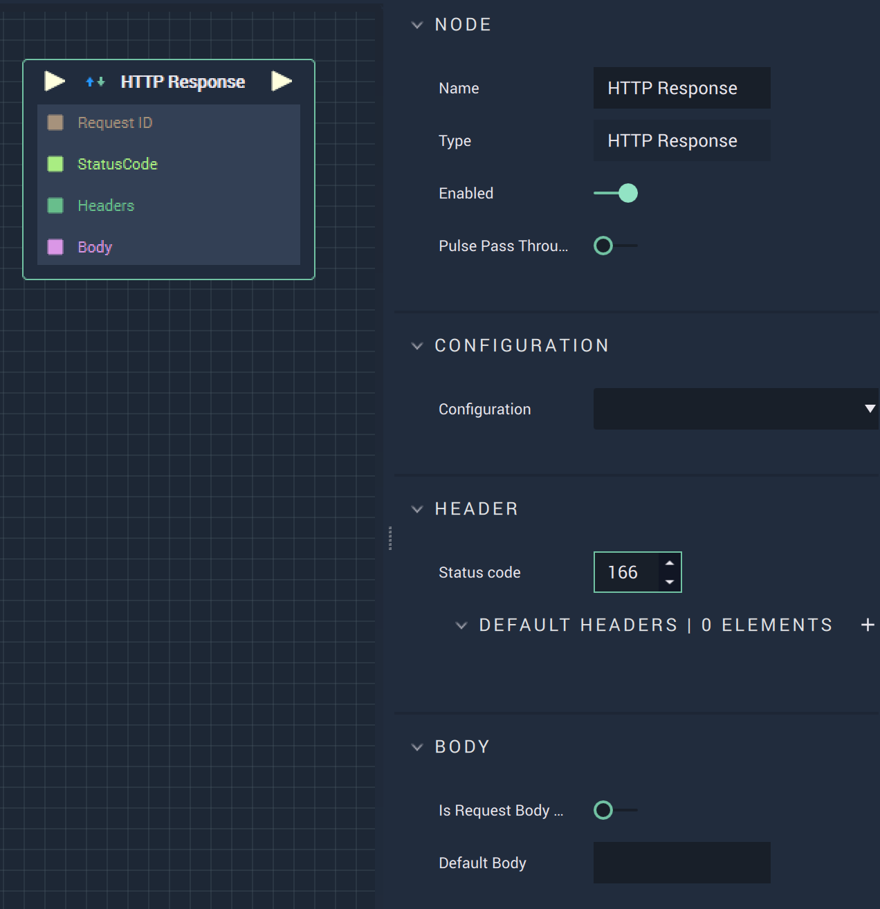

# Overview

The **HTTP Response Node** allows the user to define a response to be sent after a request is made.

# Attributes

|Attribute|Type|Description|
|---|---|---|
|`Configuration`|**Dropdown**|The desired *HTTP* server.|
|`Header`|**Add elements**|Here a status code is entered and *HTTP* headers, in the form of key/value pairs, are added.|
|`Body`|**User Input**|The body of the response, usually including *HTML* text.|

# Inputs

|Input|Type|Description|
|---|---|---|
|*Pulse Input* (►)|**Pulse**|A standard **Input Pulse**, to trigger the execution of the **Node**.|
|`Request ID`|**CustomID**|The unique ID of the request.|
|`StatusCode`|**Int**|A standard status code within the *HTTP* protocol. For example, 404 is when a page is not found.|
|`Headers`|**Dictionary**|Parameters of the call in the form of key/value pairs.|
|`Body`|**String**|The body of the response, usually including *HTML* text.|

# Outputs

|Output|Type|Description|
|---|---|---|
|*Pulse Output* (►)|**Pulse**|A standard **Output Pulse**, to move onto the next **Node** along the **Logic Branch**, once this **Node** has finished its execution.|

# External Links

* [*HTTP Responses*](https://www.toolsqa.com/client-server/http-response/)
