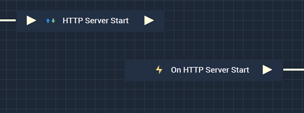
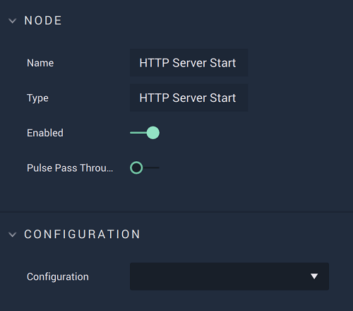

# HTTP Server Start

## Overview

The **HTTP Server Start Node** starts communication with a server that has already been set up in [**Project Settings**](../../../modules/project-settings.md#http).

It is important to note that while the **HTTP Server Start Node** starts a connection to an **HTTP Server**, it may not completely finish establishing said server when the **Node** is executed. This could lead to the **Logic** attached to its **Output Pulse** to not work even though there is technically nothing wrong. In order to avoid this, it is highly suggested to use the [**On HTTP Server Start Node**](events/onhttpserverstart.md) instead. This way, the **Logic** will only execute once the **HTTP Server** connection has definitely been established. 

Again, the user must first use the **HTTP Server Start Node** to open the connection. Separately, the **On HTTP Server Start Node** can be used to execute the desired **Communication Logic**.

[**Scope**](../overview.md#scopes): **Project**, **Scene**.

## Attributes

| Attribute | Type | Description |
| :--- | :--- | :--- |
| `Configuration` | **Drop-down** | The desired _HTTP_ server, which refers back to the selections made under *HTTP* in the [**Project Settings**](../../../modules/project-settings.md). |

## Inputs

| Input | Type | Description |
| :--- | :--- | :--- |
| _Pulse Input_ \(►\) | **Pulse** | A standard **Input Pulse**, to trigger the execution of the **Node**. |

## Outputs

| Output | Type | Description |
| :--- | :--- | :--- |
| _Pulse Output_ \(►\) | **Pulse** | A standard **Output Pulse**, to move onto the next **Node** along the **Logic Branch**, once this **Node** has finished its execution. |

## See Also

* [**HTTP Server Stop**](httpserverstop.md)

