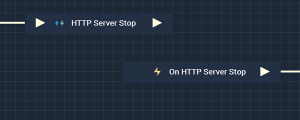

# HTTP Server Stop

## Overview

The **HTTP Server Stop Node** terminates the connection with an **HTTP Server**.

It is important to note that while the **HTTP Server Stop Node** stops the connection to an **HTTP Server**, it may not completely finish disconnecting from said connection when the **Node** is executed. This could lead to the **Logic** attached to its **Output Pulse** to not work even though there is technically nothing wrong. In order to avoid this, it is highly suggested to use the [**On HTTP Server Stop Node**](events/onhttpserverstop.md) instead. This way, the **Logic** will only execute once the **HTTP Server** has definitely been disconnected from. 

Again, the user must first use the **HTTP Server Stop Node** to close the connection. Separately, the **On HTTP Server Stop Node** can be used to execute the desired **Communication Logic**. 

[**Scope**](../overview.md#scopes): **Project**, **Scene**.

## Attributes

| Attribute | Type | Description |
| :--- | :--- | :--- |
| `Configuration` | **Drop-down** | The desired _HTTP_ server. |

## Inputs

| Input | Type | Description |
| :--- | :--- | :--- |
| _Pulse Input_ \(►\) | **Pulse** | A standard **Input Pulse**, to trigger the execution of the **Node**. |

## Outputs

| Output | Type | Description |
| :--- | :--- | :--- |
| _Pulse Output_ \(►\) | **Pulse** | A standard **Output Pulse**, to move onto the next **Node** along the **Logic Branch**, once this **Node** has finished its execution. |

## See Also

* [**HTTP Server Start**](httpserverstart.md)

