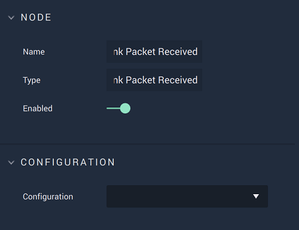

# Overview

**On MAVLink Packet Received**  is an **Event Listener Node** allowing the user to trigger a **Logic Branch** when *MAVLink* data  is received and returns it in the form of a binary `Message`. This message needs to be decoded to access the data, which is done with [**MAVLink Decode**](../mavlink-decode.md).

**MAVLink Communication** in **Incari** is available as a plugin and is enabled as default. However, in the case that it is disabled in the **Plugins Editor**, it will not appear in the **Project Settings** and **On MAVLink Packet Received** will not show up in the [**Toolbox**](../../../overview.md). Please refer to the [**Plugins Editor**](../../../modules/plugins/README.md) to find out more information.

[**Scope**](../../overview.md#scopes): **Project**, **Scene**.

# Attributes

|Attribute|Type|Description|
|---|---|---|
|`Configuration`|**Drop-Down**|The desired *MAVLink* serial port, which refers back to the selections made under *MAVLink* in the [**Project Settings**](../../../../modules/project-settings/mavlink.md).| 

# Outputs

|Output|Type|Description|
|---|---|---|
|*Pulse Output* (►)|**Pulse**|A standard **Output Pulse**, to move onto the next **Node** along the **Logic Branch**, once this **Node** has finished its execution.|
|`Message`|**Binary**|The returned `Message`. This will be given to **MAVLink Decode** to extract the data.|

# See Also

* [**MAVLink Decode**](../mavlink-decode.md)