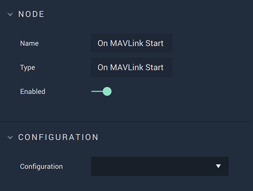

# Overview

**On MAVLink Start** is an **Event Listener Node** notifying that the **MAVLink** connection was successfully established, therefore enabling the user to trigger a **Logic Branch** on said connection.

[**Scope**](../../overview.md#scopes): **Project**, **Scene**.

# Attributes

|Attribute|Type|Description|
|---|---|---|
|`Configuration`|**Drop-Down**|The desired *MAVLink* serial port, which refers back to the selections made under *MAVLink* in the [**Project Settings**](../../../../modules/project-settings/mavlink.md).| 

# Outputs

|Output|Type|Description|
|---|---|---|
|*Pulse Output* (►)|**Pulse**|A standard **Output Pulse**, to move onto the next **Node** along the **Logic Branch**, once this **Node** has finished its execution.|

# See Also

* [**On MAVLink Stop**](on-mavlink-stop.md)
  

