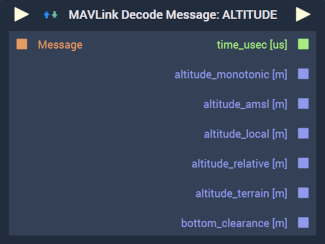
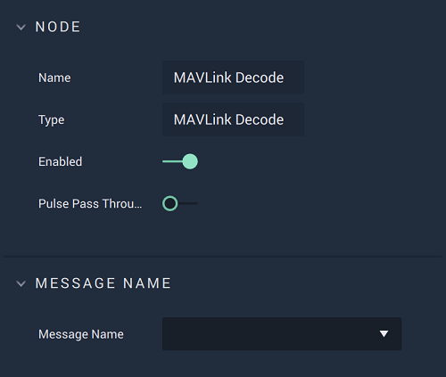

# Overview

**Mavlink Decode** decodes the binary data attributed to the `Message Name` (identifier of message type) and `Message` (message instance). The identifier comes from the `Dialect's` message definitions. The message instance originates from the output of [**On MAVLink Packet Received**](events/on-mavlink-packet-received.md). 

The `Message Name` must match the identifier in the message instance. If they are the same, the binary data will be successfully decoded and outputted to their respective outputs which appear when a `Message Name` has been selected. If not, the **Node** fails to fire correctly. 

When the `Message Name` is selected, more outputs on the **Node** are displayed. For example, if `Altitude` is selected as the identifier, the appropriate outputs for that message type will appear.

[**Scope**](../overview.md#scopes): **Project**, **Scene**, **Function**, **Prefab**.

# Attributes

|Attribute|Type|Description|
|---|---|---|
| `Message Name` | **Drop-down** | A particular message or command from the selected `Dialect` *XML* file chosen in [**Project Settings**](../../../modules/project-settings/mavlink.md) to be decoded. This defaults to the `MAVLink_Common` `Dialect` in **Project Settings** as it is the only one supported and includes the *standard* `Dialect` and its *minimal* `Dialect`. |

# Inputs

|Input|Type|Description|
|---|---|---|
|*Pulse Input* (►)|**Pulse**|A standard **Input Pulse**, to trigger the execution of the **Node**.|
|`Message`| **Binary**| The desired `Message`, which includes the message type that will be compared to the one in the selected `Message Name`.|

# Outputs

|Output|Type|Description|
|---|---|---|
|*Pulse Output* (►)|**Pulse**|A standard **Output Pulse**, to move onto the next **Node** along the **Logic Branch**, once this **Node** has finished its execution.|

# See Also

* [**On MAVLink Packet Received**](events/on-mavlink-packet-received.md)
