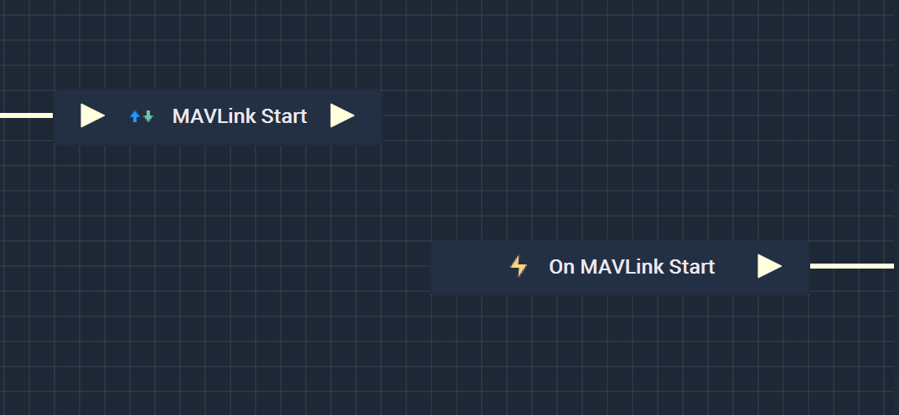
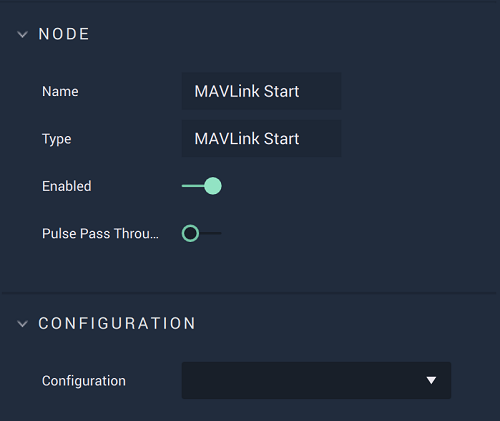

# Overview

The **MAVLink Start Node** opens communication with a **MAVLink** serial port that has already been set up in [**Project Settings**](../../../modules/project-settings/mavlink.md) and starts the *heartbeat*, which is done automatically with no action required by the user.

It is important to note that while the **MAVLink Start Node** starts a **MAVLink** connection, it may not completely finish establishing said connection when the **Node** is executed. This could lead to the **Logic** attached to its **Output Pulse** to not work even though there is technically nothing wrong. In order to avoid this, it is highly suggested to use the [**On MAVLink Start Node**](events/on-mavlink-start.md) instead. This way, the **Logic** will only execute once the **MAVLink** connection has definitely been established.

Again, the user must first use the **MAVLink Start Node** to open the connection. Separately, the **On MAVLink Start Node** can be used to execute the desired **Communication Logic**.

[**Scope**](../overview.md#scopes): **Project**, **Scene**.

# Attributes

|Attribute|Type|Description|
|---|---|---|
|`Configuration`|**Drop-Down**|The desired *MAVLink* serial port, which refers back to the selections made under *MAVLink* in the [**Project Settings**](../../../modules/project-settings/mavlink.md).| 

# Inputs

|Input|Type|Description|
|---|---|---|
|*Pulse Input* (►)|**Pulse**|A standard **Input Pulse**, to trigger the execution of the **Node**.|

# Outputs

|Output|Type|Description|
|---|---|---|
|*Pulse Output* (►)|**Pulse**|A standard **Output Pulse**, to move onto the next **Node** along the **Logic Branch**, once this **Node** has finished its execution.|

# See Also

* [**MAVLink Stop**](mavlink-stop.md)
* [**On MAVLink Start**](events/on-mavlink-start.md)

# External Links

* What is a [*heartbeat*?](https://mavlink.io/kr/services/heartbeat.html)