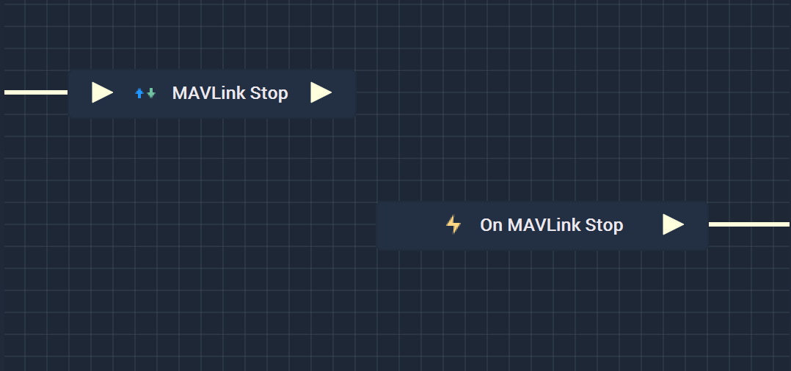
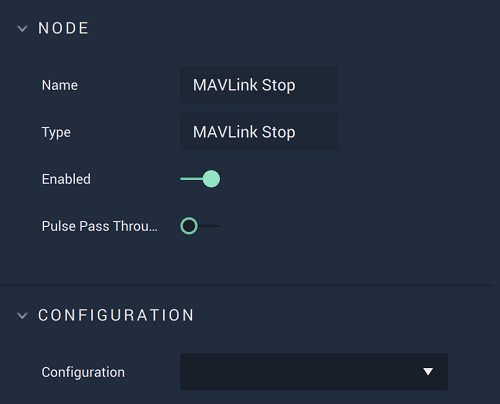

# Overview

The **MAVLink Stop Node** halts communication with a **MAVLink** serial port and ends the *heartbeat*.

**MAVLink Communication** in **Incari** is available as a plugin and is enabled as default. However, in the case that it is disabled in the **Plugins Editor**, it will not appear in the **Project Settings** and **MAVLink Stop** will not show up in the [**Toolbox**](../../overview.md). Please refer to the [**Plugins Editor**](../../../modules/plugins/README.md) to find out more information.

It is important to note that while the **MAVLink Stop Node** stops a **MAVLink** connection, it may not completely finish disconnecting from said connection when the **Node** is executed. This could lead to the **Logic** attached to its **Output Pulse** 
to not work even though there is technically nothing wrong. In order to avoid this, it is highly suggested to use 
the [**On MAVLink Stop Node**](events/on-mavlink-stop.md) instead. This way, it is assured that the **Logic** will execute once the connection to the **MAVLink** connection has been terminated.

Again, the user must first use the **MAVLink Stop Node** to close the connection. Separately, the **On MAVLink Stop Node** can be used to execute the desired **Communication Logic**. 

[**Scope**](../overview.md#scopes): **Project**, **Scene**, **Function**, **Prefab**.

# Attributes

|Attribute|Type|Description|
|---|---|---|
|`Configuration`|**Drop-Down**|The desired *MAVLink* serial port, which refers back to the selections made under *MAVLink* in the [**Project Settings**](../../../modules/project-settings.md).| 

# Inputs

|Input|Type|Description|
|---|---|---|
|*Pulse Input* (►)|**Pulse**|A standard **Input Pulse**, to trigger the execution of the **Node**.|

# Outputs

|Output|Type|Description|
|---|---|---|
|*Pulse Output* (►)|**Pulse**|A standard **Output Pulse**, to move onto the next **Node** along the **Logic Branch**, once this **Node** has finished its execution.|

# See Also

* [**MAVLink Start**](mavlink-start.md)
* [**On MAVLink Stop**](events/on-mavlink-stop.md)

# External Links

* What is a [*heartbeat*?](https://mavlink.io/kr/services/heartbeat.html)