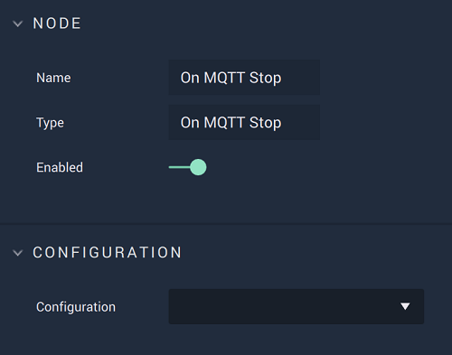

# On MQTT Stop

## Overview

**On MQTT Stop** is an **Event Listener Node** that gives the user a way to perform an action once a **MQTT** connection is disconnected.

## Attributes

| Attribute | Type | Description |
| :--- | :--- | :--- |
| `Configuration` | **Drop-down** | The connection, or signal name, that will be used. |

## Outputs

| Output | Type | Description |
| :--- | :--- | :--- |
| _Pulse Output_ \(►\) | **Pulse** | A standard **Output Pulse**, to move onto the next **Node** along the **Logic Branch**, once this **Node** has finished its execution. |

## See Also

* [**On MQTT Start**](onmqttstart.md)
* [**On MQTT Topic**](onmqtttopic.md)

