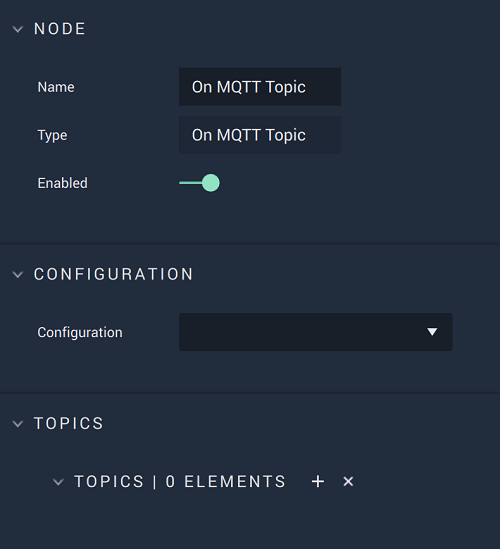

# On MQTT Topic

## Overview

**On MQTT Topic** is an **Event Listener Node** that executes when it receives an **MQTT** *Message* (only for the specificed `Topics`). `Topics` are *strings* that act as filters for *Messages* and are hierarchical, meaning there are different levels. Remember, they are case sensitive. 

In order to use this **Node**, the user must have already subscribed to the specified `Topics` with the **MQTT Subscribe Node**

[**Scope**](../../overview.md#scopes): **Project**, **Scene**.

## Attributes

| Attribute | Type | Description |
| :--- | :--- | :--- |
| `Configuration` | **Drop-down** | The connection, or signal name, that will be used. |
| `Topic` | **User Input** | The key in the **MQTT** key/value pair. |

## See Also

* [**On MQTT Start**](onmqttstart.md)
* [**On MQTT Stop**](onmqttstop.md)

## External Links

* [_An in-depth explanation of Topics_](http://www.steves-internet-guide.com/understanding-mqtt-topics/#:~:text=%20Understanding%20MQTT%20Topics%20%201%20The%20%24SYS,publish%20to%20an%20individual%20topic.%20That...%20More%20)

