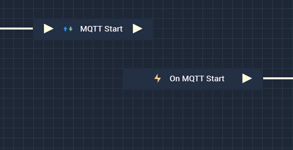

# MQTT Start

## Overview

The **MQTT Start Node** starts a **MQTT** connection that has already been set up in [**Project Settings**](../../../modules/project-settings.md#mqtt).

It is important to note that while the **MQTT Start Node** starts an **MQTT** connection, it may not completely finish establishing
said connection when the **Node** is executed. This could lead to the **Logic** attached to its **Output Pulse** 
to not work even though there is technically nothing wrong. In order to avoid this, it is highly suggested to use 
the [**On MQTT Start Node**](events/onmqttstart.md) instead. This way, the **Logic** will only execute once the **MQTT** connection has definitely been established. 

Again, the user must first use the **MQTT Start Node** to open the connection. Separately, the **On MQTT Start Node** can be used to execute the desired **Communication Logic**.

[**Scope**](../overview.md#scopes): **Project**, **Scene**.

## Attributes

| Attribute | Type | Description |
| :--- | :--- | :--- |
| `Configuration` | **Drop-down** | The connection, or signal name, that will be used. |

## Inputs

| Input | Type | Description |
| :--- | :--- | :--- |
| _Pulse Input_ \(►\) | **Pulse** | A standard **Input Pulse**, to trigger the execution of the **Node**. |

## Outputs

| Output | Type | Description |
| :--- | :--- | :--- |
| _Pulse Output_ \(►\) | **Pulse** | A standard **Output Pulse**, to move onto the next **Node** along the **Logic Branch**, once this **Node** has finished its execution. |

## See Also

* [**MQTT Stop**](mqttstop.md)
* [**MQTT Subscribe**](mqttsubscribe.md)
* [**MQTT Publish**](mqttpublish.md)

