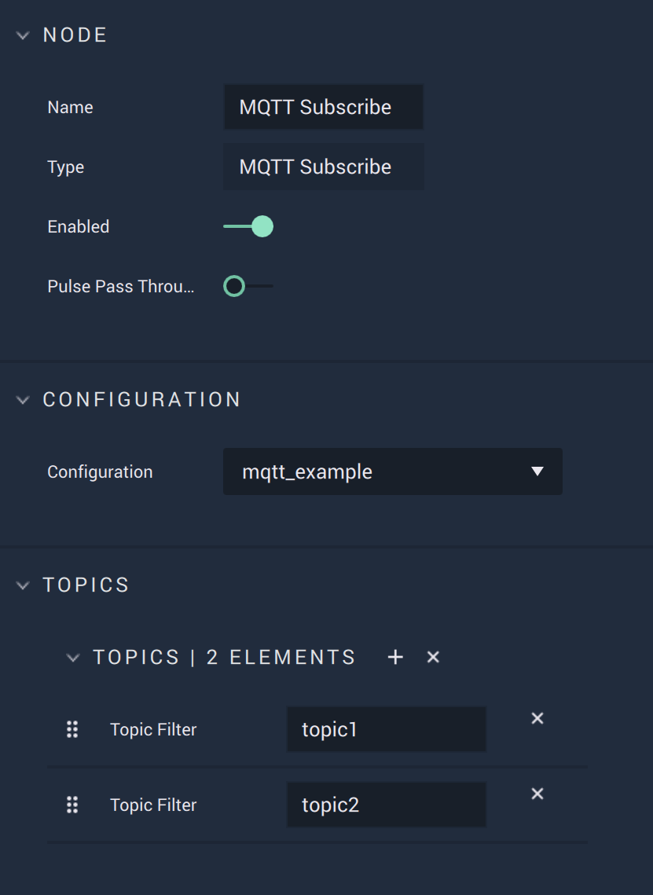

# MQTT Subscribe

## Overview

The **MQTT Subscribe** subscribes to all specified `Topics`, which [**On MQTT Topic**](events/onmqtttopic.md) is then able to receive, based on the chosen configuration in [**Project Settings**](../../../modules/project-settings.md). `Topics` are *strings* that act as filters for *Messages* and are hierarchical, meaning there are different levels. Remember, they are case sensitive.

[**Scope**](../overview.md#scopes): **Project**, **Scene**, **Function**, **Prefab**.

## Attributes

| Attribute | Type | Description |
| :--- | :--- | :--- |
| `Configuration` | **Drop-down** | The connection, or signal name, that will be used. |
| `Topic` | **User Input** | The key in the **MQTT** key/value pair, in the form _Topic/name_. |

## Inputs

| Input | Type | Description |
| :--- | :--- | :--- |
| _Pulse Input_ \(►\) | **Pulse** | A standard **Input Pulse**, to trigger the execution of the **Node**. |

## Outputs

| Output | Type | Description |
| :--- | :--- | :--- |
| _Pulse Output_ \(►\) | **Pulse** | A standard **Output Pulse**, to move onto the next **Node** along the **Logic Branch**, once this **Node** has finished its execution. |

## See Also

* [**MQTT Start**](mqttstart.md)
* [**MQTT Stop**](mqttstop.md)
* [**MQTT Publish**](mqttpublish.md)

## External Links

* [_An in-depth explanation of Topics_](http://www.steves-internet-guide.com/understanding-mqtt-topics/#:~:text=%20Understanding%20MQTT%20Topics%20%201%20The%20%24SYS,publish%20to%20an%20individual%20topic.%20That...%20More%20)

